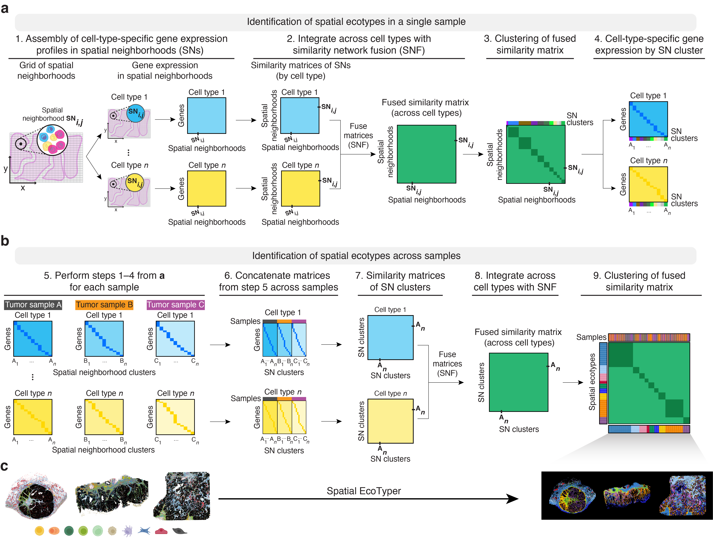

```{r setup, include=FALSE}
knitr::opts_chunk$set(echo = TRUE, warning = FALSE, message = FALSE)
```

# Overview

In this tutorial, we will illustrate how to identify conserved spatial ecotypes (SEs) across multiple samples using the [MultiSpatialEcoTyper](../reference/MultiSpatialEcoTyper.html) function. Each sample represents a single-cell spatial transcriptomics data, including a gene expression profile and associated single-cell metadata.

We will be analyzing single-cell spatial transcriptomics data from cancer samples provided by [Vizgen's MERSCOPE FFPE Human Immuno-oncology](https://vizgen.com/data-release-program/). For efficiency, we have selected a subset of regions from a melanoma sample and a colon cancer sample for the integrative analysis. You can download the gene expression profiles and single-cell metadata [`here`](https://drive.google.com/open?id=1CYncsGZ4aTaIRGkR4rVAmbOGskVyoTEQ&usp=drive_fs). 

The melanoma sample includes spatial expression data for 500 genes across 27,907 cells, while the colon cancer sample contains data for 38,080 cells. In both samples, cells were categorized into ten distinct cell types: B cells, CD4+ T cells, CD8+ T cells, NK cells, plasma cells, macrophages, dendritic cells (DC), fibroblasts, endothelial cells, and cancer cells. Cancer cells are excluded from this demonstration to reduce processing time.

All cells are grouped into four spatial regions: tumor, inner margin, outer margin, and stroma. The tumor and stroma regions are defined based on the density of cancer cells, as described in the [CytoSPACE paper](https://www.nature.com/articles/s41587-023-01697-9). The inner and outer margins are defined as regions extending 250 μm inside and outside the tumor boundaries, respectively. Furthermore, we quantified each cell’s distance to the tumor–stroma interface by calculating the shortest Euclidean distance to the nearest tumor region (for stromal cells) or stromal region (for tumor cells). A positive distance indicates cells located within the tumor region, while a negative distance indicates cells located within the stroma.

__First load required packages for this vignette__

```{r lib}
suppressPackageStartupMessages(library(dplyr))
suppressPackageStartupMessages(library(ggplot2))
suppressPackageStartupMessages(library(parallel))
suppressPackageStartupMessages(library(Seurat))
suppressPackageStartupMessages(library(data.table))
suppressPackageStartupMessages(library(googledrive))
suppressPackageStartupMessages(library(NMF))
suppressPackageStartupMessages(library(ComplexHeatmap))
library(SpatialEcoTyper)
```

# Loading data

**Spatial EcoTyper** analysis requires two input data for each sample:

* gene expression matrix: rows represent gene names and columns represent cell IDs
* meta data: a data frame with at least three columns, including "X" (X-coordinate), "Y" (Y-coordinate), and "CellType" (cell type annotation). The row names of the meta data should match the column names (cell IDs) in the expression matrix.

<details open><summary><strong>Text files as input</strong></summary>

First, download the demo data from Google Drive

```{r download, eval=FALSE}
drive_deauth() # Disable Google sign-in requirement
drive_download(as_id("1CoQmU3u8MoVC8RbLUvTDQmOuJJ703HHB"), "HumanMelanomaPatient1_subset_counts.tsv.gz", overwrite = TRUE)
drive_download(as_id("1CgUOQKrWY_TG61o5aw7J9LZzE20D6NuI"), "HumanMelanomaPatient1_subset_scmeta.tsv", overwrite = TRUE)
drive_download(as_id("1ChwONUjr_yoURodnkDBj68ZUbjdHtmP6"), "HumanColonCancerPatient2_subset_counts.tsv.gz", overwrite = TRUE)
drive_download(as_id("1CipRjjD7cqzqKO0Yf4LUdsEw1XDzP6JS"), "HumanColonCancerPatient2_subset_scmeta.tsv", overwrite = TRUE)
```

Then, load text files into R. You can use `read.table` for small files or `data.table::fread` for larger files.

```{r loaddata}
# Load single-cell metadata
# Row names should be cell ids. Required columns: X, Y, CellType; 
# Recommend a 'Region' column if pathologist region annotations are available
scmeta1 <- read.table("HumanMelanomaPatient1_subset_scmeta.tsv",
                      sep = "\t", header = TRUE, row.names = 1)
scmeta2 <- read.table("HumanColonCancerPatient2_subset_scmeta.tsv",
                      sep = "\t", header = TRUE, row.names = 1)
head(scmeta1[, c("X", "Y", "CellType", "Region")])
head(scmeta2[, c("X", "Y", "CellType", "Region")])

# Load single-cell gene expression data. Rows represent gene names and columns represent cell IDs
scdata1 <- fread("HumanMelanomaPatient1_subset_counts.tsv.gz",
                sep = "\t",header = TRUE, data.table = FALSE)
rownames(scdata1) <- scdata1[, 1]  # Setting the first column as row names
scdata1 <- as.matrix(scdata1[, -1]) # Dropping first column

scdata2 <- fread("HumanColonCancerPatient2_subset_counts.tsv.gz",
                sep = "\t",header = TRUE, data.table = FALSE)
rownames(scdata2) <- scdata2[, 1] # Setting the first column as row names
scdata2 <- as.matrix(scdata2[, -1]) # Dropping first column
head(scdata1[,1:5])
head(scdata2[,1:5])

# Make sure row names of the meta data match column names of the gene expression matrix
scdata1 <- scdata1[, match(rownames(scmeta1), colnames(scdata1))]
scdata2 <- scdata2[, match(rownames(scmeta2), colnames(scdata2))]
```
</details>


<details><summary><strong>Sparse matrix as input</strong></summary>

Mtx files can be loaded into R using the [`ReadMtx` function](https://satijalab.org/seurat/reference/readmtx) from the Seurat package.

```{r download2, eval = FALSE}
drive_download(as_id("13M3xhRxp0xK9gf5F4DE9idSBFqVQIXDT"), "HumanMelanomaPatient1_subset_counts.mtx.gz", overwrite = TRUE)
drive_download(as_id("136feRaFjMtNvduLTm5xqa3WhyyoG4Xzo"), "HumanMelanomaPatient1_subset_cells.tsv.gz", overwrite = TRUE)
drive_download(as_id("13QprWzJhzzUy_w3XSrjlt9pjf2n-G7HV"), "HumanMelanomaPatient1_subset_genes.tsv.gz", overwrite = TRUE)

drive_download(as_id("17fH9BAAugYi1FMLrMuTxojtOoklFBB-K"), "HumanColonCancerPatient2_subset_counts.mtx.gz", overwrite = TRUE)
drive_download(as_id("17a1f1VjxJSje_uyPt6zA97zTps9ko6rk"), "HumanColonCancerPatient2_subset_cells.tsv.gz", overwrite = TRUE)
drive_download(as_id("17fH0jE5b2YqJ5fpQtYil27k-7YhzArD6"), "HumanColonCancerPatient2_subset_genes.tsv.gz", overwrite = TRUE)
```

```{r readmtx, eval = FALSE}
scdata1 <- ReadMtx(mtx = "HumanMelanomaPatient1_subset_counts.mtx.gz", cells = "HumanMelanomaPatient1_subset_cells.tsv.gz", features = "HumanMelanomaPatient1_subset_genes.tsv.gz", feature.column = 1, cell.column = 1)
scdata2 <- ReadMtx(mtx = "HumanColonCancerPatient2_subset_counts.mtx.gz", cells = "HumanColonCancerPatient2_subset_cells.tsv.gz", features = "HumanColonCancerPatient2_subset_genes.tsv.gz", feature.column = 1, cell.column = 1)
```
</details>


# Data normalization

Gene expression data should be normalized for the `SpatialEcoTyper` analysis. This can be achieved using either [NormalizeData](https://satijalab.org/seurat/reference/normalizedata) or [SCTransform](https://satijalab.org/seurat/articles/seurat5_spatial_vignette_2). Alternatively, you may skip this step and allow the [MultiSpatialEcoTyper](../reference/MultiSpatialEcoTyper.html) function to handle normalization by specifying the desired method (e.g., SCT) in the `normalization.method` argument.

<details><summary><strong>Using `SCTransform` for the normalization:</strong></summary>
For faster computation, it is recommended to install the `glmGamPoi` package for the [SCTransform](https://satijalab.org/seurat/articles/seurat5_spatial_vignette_2) normalization.

```{r SCTransform, eval = TRUE}
## Install the glmGamPoi package
if(!"glmGamPoi" %in% installed.packages()){
  BiocManager::install("glmGamPoi")
}

## Data normalization
tmpobj1 <- CreateSeuratObject(scdata1) %>%
      SCTransform(clip.range = c(-10, 10), verbose = FALSE)
tmpobj2 <- CreateSeuratObject(scdata2) %>%
      SCTransform(clip.range = c(-10, 10), verbose = FALSE)

## Extract the normalized gene expression data
seurat_version = as.integer(gsub("\\..*", "", as.character(packageVersion("SeuratObject"))))
if(seurat_version<5){
  normdata1 <- GetAssayData(tmpobj1, "data")
  normdata2 <- GetAssayData(tmpobj2, "data")
}else{
  normdata1 <- tmpobj1[["SCT"]]$data
  normdata2 <- tmpobj2[["SCT"]]$data
}
```
</details>

<details><summary><strong>Using `NormalizeData` for the normalization:</strong></summary>
```{r NormalizeData, eval = FALSE}
normdata1 <- NormalizeData(scdata1)
normdata2 <- NormalizeData(scdata2)
```
</details>


# Preview of the samples

The [SpatialView](../reference/SpatialView.html) function can be used to visualize single cells within the tissue. You can color the cells by cell type or predefined spatial regions.

```{r viewct, fig.height=3}
# Visualize the cell type annotations in the tissue
p1 <- SpatialView(scmeta1, by = "CellType") + labs(title = "SKCM") +
        scale_color_manual(values = pals::cols25()) + theme(legend.position = "none")
p2 <- SpatialView(scmeta2, by = "CellType") + labs(title = "CRC") +
        scale_color_manual(values = pals::cols25())
p1 + p2
```

```{r viewregion, fig.height=3}
# Visualize the regions in the tissue
p1 <- SpatialView(scmeta1, by = "Region") + labs(title = "SKCM") +
        scale_color_brewer(type = "qual", palette = "Set1") + 
        theme(legend.position = "none")
p2 <- SpatialView(scmeta2, by = "Region") + labs(title = "CRC") +
        scale_color_brewer(type = "qual", palette = "Set1")
p1 + p2
```

The [SpatialView](../reference/SpatialView.html) function can also be used to visualize continuous characteristics, such as the minimum distance of each single cell to tumor/stroma margin. Here, positive distances indicate cells located within the tumor region, while negative distances denote cells within the stroma. 

```{r viewdist, fig.height=3}
# Visualize the distance to tumor margin
p1 <- SpatialView(scmeta1, by = "Dist2Interface") + labs(title = "SKCM") + 
        scale_colour_gradient2(low = "#5e3c99", high = "#e66101", mid = "#d9d9d9", midpoint = 0) +
        theme(legend.position = "none")
p2 <- SpatialView(scmeta2, by = "Dist2Interface") + labs(title = "CRC") + 
        scale_colour_gradient2(low = "#5e3c99", high = "#e66101", mid = "#d9d9d9", midpoint = 0) + labs(color = "Distance to\ntumor margin")
p1 + p2
```

```{r viewgene, fig.height=3}
## Visualize gene expression in the tissue
gg <- scmeta1
gg$Expression <- normdata1["STAT1", ]
p1 <- SpatialView(gg, by = "Expression") + 
  scale_color_viridis_c() + labs(color = "STAT1")
gg <- scmeta2
gg$Expression <- normdata2["STAT1", ]
p2 <- SpatialView(gg, by = "Expression") + 
  scale_color_viridis_c() + labs(color = "STAT1")
p1 + p2
```

# Spatial EcoTyper analysis across multiple samples

```{r workflow, out.width = '100%', echo=FALSE}

```

The [MultiSpatialEcoTyper](../reference/SpatialView.html) function enables the integration of single-cell spatial transcriptomics data across multiple samples, facilitating the identification of SEs shared across samples or cancer types. The analysis is performed in three stages:
  
-   **Independent Spatial EcoTyper Analysis**: [Spatial EcoTyper](../reference/SpatialEcoTyper.html) analysis is performed on each single-cell ST sample to identify spatial neighborhood clusters.
-   **Integration via Similarity Network Fusion**: The spatial clusters from individual samples are represented by gene expression profiles (GEPs) of their associated cell states. These cell type–specific GEPs are integrated using Similarity Network Fusion (Wang et al., 2014), producing a unified similarity network of spatial clusters across all samples.
-   **NMF Clustering**: Non-negative Matrix Factorization (NMF) is applied to the unified network embedding to identify conserved SEs across samples.

<details open><summary><strong>Key arguments for `MultiSpatialEcoTyper`</strong></summary>

-   `data_list` A named list of expression matrices where each matrix represents gene expression data for a sample. The columns of each matrix correspond to cells, and the rows correspond to genes. The list names should match sample names; otherwise, samples will be named as ‘Sample1’, ‘Sample2’, etc.
-   `metadata_list` A named list of metadata data frames, where each data frame contains metadata corresponding to the cells in the expression matrices. Each metadata data frame should include at least three columns (X, Y, CellType), and the row names should match the cell IDs (column names) in the expression matrix.
-   `outdir` Directory where the results will be saved. Defaults to the current directory with a subdirectory named "SpatialEcoTyper_results_" followed by the current date.
-   `normalization.method` Method for normalizing the expression data. Options include "None" (default), "SCT", or other methods compatible with Seurat's `NormalizeData` function.
-   `nmf_ranks` Integer or vector specifying the number of clusters (10 by default). If a vector is provided, the function tests all ranks and selects the optimal rank for NMF, though this may increase computation time.
-   `radius` Numeric specifying the radius (in the same units as spatial coordinates) for defining spatial neighborhoods around each cell. Default is 50.
-   `minibatch` Integer specifying the number of columns (default: 5000) to process in each minibatch in the SNF analysis. This option splits the matrix into smaller chunks, thus reducing memory usage.
-   `ncores` Integer specifying the number of cores for parallel processing (default: 1).

You can type `?MultiSpatialEcoTyper` to visualize the full manual.

</details>

**Important note**: In the examples below, we will use 10 clusters and 5 runs per rank for demonstration purposes. To select the optimal number of clusters and obtain robust results, you can use the `nmf_ranks` argument with a vector of integers to test multiple ranks for NMF analysis. You can also use the [nmfClustering](../reference/nmfClustering.html) function for the rank selection, as outlined in the next section (`NMF clustering for SpatialEcoTyper`).

## Preparing data
```{r preparedata, eval=TRUE}
data_list <- list(SKCM = normdata1, CRC = normdata2)
metadata_list <- list(SKCM = scmeta1, CRC = scmeta2)
```

## Pathologist region annotation unavailable

<details open><summary>`MultiSpatialEcoTyper` analysis (without region annotation)</summary>

```{r multi, eval=FALSE}
MultiSpatialEcoTyper(data_list, metadata_list, 
                     normalization.method = "None", # Normalization method
                     nmf_ranks = 10,  # Number of clusters
                     nrun.per.rank = 5,  # Recommend 30 or higher for robust results
                     ncores = 2)
# This demo takes ~3 minutes on a macOS with an Apple M1 Pro chip and 16 GB memory.
```
</details>


## Pathologist region annotation available

If tumor and adjacent stroma region annotations are available, we recommend to include the annotations in all metadata and specify the `Region` in the [MultiSpatialEcoTyper](../reference/MultiSpatialEcoTyper.html) function, which could improve integration accuracy.

```{r multi2, eval=TRUE}
## Annotation of tumor and stroma regions will be considered for the analysis.
metadata_list$SKCM$Region2 = metadata_list$SKCM$Region
metadata_list$CRC$Region2 = metadata_list$CRC$Region
metadata_list$SKCM$Region2 = ifelse(metadata_list$SKCM$Dist2Interface<0, "Stroma", "Tumor")
metadata_list$CRC$Region2 = ifelse(metadata_list$CRC$Dist2Interface<0, "Stroma", "Tumor")
MultiSpatialEcoTyper(data_list, metadata_list, 
                     normalization.method = "None", # Normalization method
                     min.cts.per.region = 2, # At least two cell types in each spatial neighborhood
                     nmf_ranks = 10,  # Number of clusters
                     nrun.per.rank = 5,  # Recommend 30 or higher for robust results
                     Region = "Region2", # Use pathologist annotations if available
                     ncores = 2)
## This demo takes ~3 minutes to complete on macOS with an Apple M1 Pro chip and 16 GB memory.
```

## Pathologist region annotation available (2)

You can specify the `nmf_ranks` argument with a vector of integers to test multiple ranks, enabling the selection of the optimal number of clusters.

```{r multi3, eval=FALSE}
## Annotation of tumor and stroma regions will be considered for the analysis.
metadata_list$SKCM$Region2 = metadata_list$SKCM$Region
metadata_list$CRC$Region2 = metadata_list$CRC$Region
metadata_list$SKCM$Region2 = ifelse(metadata_list$SKCM$Dist2Interface<0, "Stroma", "Tumor")
metadata_list$CRC$Region2 = ifelse(metadata_list$CRC$Dist2Interface<0, "Stroma", "Tumor")
MultiSpatialEcoTyper(data_list, metadata_list, 
                     normalization.method = "None", # Normalization method
                     nmf_ranks = seq(4,15,2),  # Number of clusters
                     nrun.per.rank = 30,  # 30 runs per rank for robust results
                     Region = "Region2", # Use pathologist annotations
                     ncores = 2)
## This demo takes ~16 minutes to complete on macOS with an Apple M1 Pro chip and 16 GB memory.
```

<details><summary><strong>Using pre-existing Spatial EcoTyper results</strong></summary>

If you’ve already run [SpatialEcoTyper](../reference/SpatialEcoTyper.html) for each sample, you can integrate the results directly using [IntegrateSpatialEcoTyper](../reference/IntegrateSpatialEcoTyper.html).

```{r downloadres, eval=FALSE}
drive_download(as_id("1lAfzK6v1jnthjmPEHgcnQFKr-pRMSqRm"), "CRC_SpatialEcoTyper_results.rds", overwrite = TRUE)
drive_download(as_id("1dPtmNrH0piUbzB_tltYkD-AoXLvf6P3Q"), "SKCM_SpatialEcoTyper_results.rds", overwrite = TRUE)
```

```{r integrate, eval = FALSE}
data_list <- list(SKCM = normdata1, CRC = normdata2)
SpatialEcoTyper_list <- list(SKCM = readRDS("SKCM_SpatialEcoTyper_results.rds"),
                             CRC = readRDS("CRC_SpatialEcoTyper_results.rds"))
IntegrateSpatialEcoTyper(SpatialEcoTyper_list, data_list, 
                         outdir = "SpatialEcoTyper_results/",
                         normalization.method = "None", 
                         nmf_ranks = 10, # Number of clusters
                         nrun.per.rank = 5,  # recommend 30 or higher for robust results
                         Region = "Region2", # Use pathologist annotations if available
                         ncores = 2)
# This demo takes ~3 minutes on a macOS with an Apple M1 Pro chip and 16 GB memory.
```
</details>

<details><summary><strong>Optimizing memory usage</strong></summary>
For large single-cell spatial transcriptomics (ST) datasets with more than 100,000 cells, the analysis can be both time- and memory-intensive. To accelerate computation, you can increase the number of cores used (`ncores`), but this will also increase memory consumption.

If computational memory is limited, several strategies can help reduce usage. One option is to increase the `grid.size`, which decreases the number of spatial neighborhoods and can substantially decrease memory usage. Another option is to reduce the `minibatch` size and the number of cores (`ncores`). However, the minimum memory requirement may still remain high for very large datasets.

</details>

<details><summary><strong>Interested in multicellular communities associated with specific cell types?</strong></summary>

If you’re interested in studying multicellular communities associated with specific cell types, you can use the `filter.region.by.celltypes` argument to restrict the analysis to spatial neighborhoods that include at least one cell of the specified types. An example is available in [Discovery of Spatial Ecotypes from a Single Sample](./SingleSample.html).

</details>

<details><summary><strong>Interested in regions with multiple cell types?</strong></summary>

If you’re interested in regions composed of multiple cell types, you can use the `min.cts.per.region` argument to restrict the analysis to spatial neighborhoods containing at least the specified minimum number of distinct cell types.

</details>


# Output results

All results will be saved in the specified directory (`outdir`) with a subdirectory named `SpatialEcoTyper_results_` followed by the current date. The output files include:

-   **`(SampleName)_SpatialEcoTyper_results.rds`** `SpatialEcoTyper` result for each sample.
-   **MultiSE_integrated_final.rds** A matrix representing the fused similarity matrix of spatial clusters across all samples.
-   **MultiSE_integrated_final_hmap.pdf** A heatmap visualizing the fused similarity matrix of spatial clusters, grouped by samples and SEs.
-   **MultiSE_metadata_final.rds** Single-cell metadata with an 'SE' column annotating the discovered SEs, saved as an RDS file.
-   **MultiSE_metadata_final.tsv** The same as `MultiSE_metadata_final.rds`, but saved in TSV format.
-   **SpatialView_SEs_by_Sample.pdf** A figure showing the spatial landscape of SEs across samples.
-   **BarView_SEs_Sample_Frac.pdf** A bar plot showing the fraction of cells from each sample represented within each SE.
-   **BarView_SEs_Region_Frac_Avg.pdf** A bar plot showing the average fraction of regions represented within each SE.
-   **BarView_SEs_CellType_Frac_Avg.pdf** A bar plot showing the average cell type composition within each SE.
-   **MultiSE_NMF_results.rds** The NMF result derived from the `nmfClustering` function. If a single rank was provided, it contains an `NMFfitX1` object . If multiple ranks were provided, it is a `list` containing the optimal number of communities (`bestK`), a list of `NMFfitX1` objects (`NMFfits`), and a `ggplot` object (`p`) displaying the cophenetic coefficient for different cluster numbers.
-   **MultiSE_NMF_Cophenetic_Dynamics.pdf** A figure showing the cophenetic coefficients for different numbers of clusters, only available when multiple ranks were provided.

The results for the demo data can be downloaded from [`MultiSpatialEcoTyper_results`](https://drive.google.com/open?id=1H4S71HENMoig03O3FdeLwnwk2aja-Wtv&usp=drive_fs).

# NMF clustering

**Spatial EcoTyper** uses NMF to group spatial clusters from multiple samples into conserved SEs. To determine the optimal number of clusters, or rank, we computed cophenetic coefficient, which quantifies the classification stability for a given rank (i.e., the number of clusters) and ranges from 0 to 1, with 1 indicating maximally stability. 
Typically, the rank at which the cophenetic coefficient begins to decrease is chosen. However, this method can be challenging when the cophenetic coefficient exhibits a multi-modal shape across different ranks. In such cases, for **Spatial EcoTyper** analysis, we recommend selecting the number of SEs after which the coefficient drops below 0.95 by default.

## Selecting the optimal rank

To determine the optimal rank, you can use the [nmfClustering](../reference/nmfClustering.html) function, which tests multiple ranks and computes the cophenetic coefficient for each. This analysis requires the fused similarity network matrix (`MultiSE_integrated_final.rds`) generated from previous step.

Load the files into R:
```{r loadintegrated}
## Fused similarity matrix of spatial clusters across all samples
outdir = paste0("SpatialEcoTyper_results_", Sys.Date())
integrated = readRDS(file.path(outdir, "MultiSE_integrated_final.rds"))
dim(integrated)

## Single-cell metadata with an 'SE' column annotating the discovered SEs
finalmeta = readRDS(file.path(outdir, "MultiSE_metadata_final.rds"))
head(finalmeta[, c("Sample", "X", "Y", "CellType", "Region", "InitSE", "SE")])
```

Next, test multiple ranks to find the optimal number of SEs. The running time for this step depends on the data size, number of ranks to test, the number of runs per rank, and the number of cores for parallel analysis. For demonstration, here we test six different ranks ranging from 4 to 15 with 5 runs per rank.

```{r nmfcluster}
nmf_res <- nmfClustering(integrated, ranks = seq(4,15,2),
                         nrun.per.rank = 5, # Recommend 30 or higher
                         min.coph = 0.99, # minimum cophenetic coefficient threshold
                         ncores = 4,
                         seed = 2024)
## This process takes ~3 minutes on a macOS with an Apple M1 Pro chip and 16 GB of memory
paste0("The selected rank is ", nmf_res$bestK)
```

To better understand how the cophenetic coefficient changes with different ranks, you can visualize the results.
```{r coph}
plot(nmf_res$p)
```

Once the optimal rank is determined, you can use it to generate the final SE annotations.

```{r nmfresult}
ses <- predict(nmf_res$NMFfits[[paste0("K.", nmf_res$bestK)]])
head(ses)
```

You can add the newly defined SEs into the meta data:
```{r updatemeta}
finalmeta$SE = paste0("SE", ses[finalmeta$InitSE])
head(finalmeta)
```

## Using a different rank

If you simply want to experiment with a different rank, you can use the [nmfClustering](../reference/nmfClustering.html) function. When a single rank is specified, it directly returns an NMFfit object for predicting SE grouping, as shown below:
```{r updaterank}
nmf_res <- nmfClustering(integrated, ranks = 10, nrun.per.rank = 30, 
                         seed = 1, ncores = 1)
ses <- predict(nmf_res)
## This process takes ~6 minutes on a macOS with an Apple M1 Pro chip and 16 GB of memory
```

You can add the newly defined SEs into the meta data
```{r updatemeta2}
finalmeta$SE = paste0("SE", ses[finalmeta$InitSE])
head(finalmeta)
```

# Visualizing SEs

## Visualizing the integrated similarity matrix

After reordering spatial clusters based on the newly identified SEs, you can re-draw the heatmap to show the fused similarity matrix of spatial clusters across samples.

```{r newsehmap}
ords = names(ses)[order(ses)]
integrated = integrated[ords, ords] # reorder the cells
ann <- data.frame(Sample = gsub("\\.\\..*", "", rownames(integrated)),
                  SE = paste0("SE", ses[ords]),
                  row.names = rownames(integrated)) # cell groups
SE_cols <- getColors(length(unique(ann$SE)), palette = 1) # colors for SEs
names(SE_cols) <- unique(ann$SE)
sample_cols <- getColors(length(unique(ann$Sample)), palette = 2) # colors for samples
names(sample_cols) <- unique(ann$Sample)

## draw heatmap
HeatmapView(integrated, show_row_names = FALSE, show_column_names = FALSE,
            top_ann = ann, top_ann_col = list(Sample = sample_cols, SE = SE_cols))
drawRectangleAnnotation(ann$SE, ann$SE)
```

## Visualizing SEs in the tissue

The spatial distribution of SEs within the tissue can be visualized using the [SpatialView](../reference/SpatialView.html) function.

```{r spatialmapse, fig.height=3}
SpatialView(finalmeta, by = "SE")  + facet_wrap(~Sample, scales = "free")
```

## Association between SEs and pre-annotated regions

This bar plot shows the enrichment of SEs in pre-defined regions (e.g., tumor and stroma).

```{r bar_region1}
gg <- finalmeta %>% filter(!is.na(SE)) %>% count(SE, Region, Sample) %>% 
    group_by(Sample, SE) %>% mutate(Frac = n / sum(n)) %>% ## cell type fractions within each sample
    group_by(SE, Region) %>% summarise(Frac = mean(Frac)) ## average cell type fractions across all samples
ggplot(gg, aes(SE, Frac, fill = Region)) + 
  geom_bar(stat = "identity", position = "fill") + 
  scale_fill_brewer(type = "qual", palette = "Set1") +
  theme_bw(base_size = 14) + coord_flip() + 
  labs(y = "Fraction")
```

<details><summary><strong>Association between SEs and pre-annotated regions within each sample</strong></summary>
```{r bar_region2}
gg <- finalmeta %>% filter(!is.na(SE)) %>% count(SE, Region, Sample)

ggplot(gg, aes(SE, n, fill = Region)) + 
  geom_bar(stat = "identity", position = "fill") + 
  scale_fill_brewer(type = "qual", palette = "Set1") +
  facet_wrap(~Sample) +
  theme_bw(base_size = 14) + coord_flip() + 
  labs(y = "Fraction of regions")
```
</details>


## Distance of SEs to tumor/stroma interface

This box plot visualizes the distribution of distances of SEs to the tumor/stroma interface. Positive distances indicate cells located within the tumor region, while negative distances denote cells within the stroma. The SEs are ordered by their median distance, highlighting their spatial localization relative to the tumor/stroma interface.

```{r box_dist}
gg <- finalmeta %>% filter(!is.na(SE)) %>% group_by(Sample, SE) %>% 
  summarise(Dist2Interface = mean(Dist2Interface)) %>% arrange(Dist2Interface)
gg$SE = factor(gg$SE, levels = unique(gg$SE))
ggplot(gg, aes(SE, Dist2Interface)) + geom_boxplot() + 
  geom_point(aes(color = Sample)) + theme_bw() + 
  labs(y = "Distance to tumor/stroma interface (μm)")
```

## Cell type composition of SEs

We can visualize the cell type composition of SEs in a bar plot. The cell type fractions can be averaged across the two samples.

__Average cell type composition of SEs across all samples__
```{r bar_ct2}
gg <- finalmeta %>% filter(!is.na(SE)) %>% count(SE, CellType, Sample) %>% 
    group_by(Sample, SE) %>% mutate(Frac = n / sum(n)) %>% ## cell type fractions within each sample
    group_by(SE, CellType) %>% summarise(Frac = mean(Frac)) ## average cell type fractions across all samples

ggplot(gg, aes(SE, Frac, fill = CellType)) + 
  geom_bar(stat = "identity", position = "fill") +
  scale_fill_manual(values = pals::cols25()) +
  theme_bw(base_size = 14) + coord_flip() + 
  labs(y = "Cell type abundance")
```

<details><summary><strong>Cell type composition of SEs within each sample</strong></summary>
```{r bar_ct1}
gg <- finalmeta %>% filter(!is.na(SE)) %>% count(SE, CellType, Sample)

ggplot(gg, aes(SE, n, fill = CellType)) + 
  geom_bar(stat = "identity", position = "fill") +
  scale_fill_manual(values = pals::cols25()) +
  facet_wrap(~Sample) +
  theme_bw(base_size = 14) + coord_flip() + 
  labs(y = "Cell type abundance")
```
</details>


# Identification of cell-type-specific SE markers

You can identify cell-type-specific SE markers by differential expression analysis using the [`presto` package](https://github.com/immunogenomics/presto). Below is an example of how to identify fibroblast-specific markers for each SE.

## DE analysis within each sample

```{r deg}
require("presto")
## DE analysis within the first sample
tmpmeta1 = finalmeta %>% filter(CellType=="Fibroblast" & Sample=="SKCM" & (!is.na(SE)))
tmpdata1 = normdata1[, tmpmeta1$CID]
degs1 = wilcoxauc(tmpdata1, tmpmeta1$SE)
## DE analysis within the second sample
tmpmeta2 = finalmeta %>% filter(CellType=="Fibroblast" & Sample=="CRC" & (!is.na(SE)))
tmpdata2 = normdata2[, tmpmeta2$CID]
degs2 = wilcoxauc(tmpdata2, tmpmeta2$SE) # DE analysis

head(degs1)
head(degs2)
```

## Identifying conserved markers across samples

To identify markers conserved across different samples, we conduct a meta-analysis by averaging the log2 fold changes (log2FC) from the DE analyses.

```{r metadeg}
library(tidyr)
degs <- merge(degs1[, c(1,2,4)], degs2[, c(1,2,4)], by = c("feature", "group"))
degs$AvgLogFC = (degs$logFC.x + degs$logFC.y) / 2
lfcs = degs %>% pivot_wider(id_cols = feature, names_from = group, 
                            values_from = AvgLogFC) %>% as.data.frame
rownames(lfcs) <- lfcs$feature
lfcs <- lfcs[, -1]
head(lfcs)
```

To identify markers that are specific to each SE-associated cell state, we calculate the difference between the maximum log2FC for each gene and the second-highest log2FC:

```{r metadeg2}
secondmax = apply(lfcs, 1, function(x){ -sort(-x)[2] })
delta = lfcs - secondmax
## Markers are considered specific if they have a positive delta and a log2FC greater than 0.05:
idx = delta>0 & lfcs>0.05
markers = lapply(colnames(lfcs), function(se){
  gs = rownames(idx)[idx[, se]]
  gs = gs[order(-lfcs[gs, se])]
  gs
})
names(markers) = colnames(lfcs)
markers = markers[lengths(markers)>0]
## Select the top five markers
top5 = lapply(markers, function(x){ x[1:min(5, length(x))] })
top5
```

## Visualizing top SE cell state markers

```{r hmaptop, fig.height=7}
gg = t(scale(t(lfcs[unlist(top5), ]), center = FALSE))
HeatmapView(gg, breaks = c(0, 1, 1.5))
```

# Session info

The session info allows users to replicate the exact environment and identify potential discrepancies in package versions or configurations that might be causing problems.

```{r session}
sessionInfo()
```

