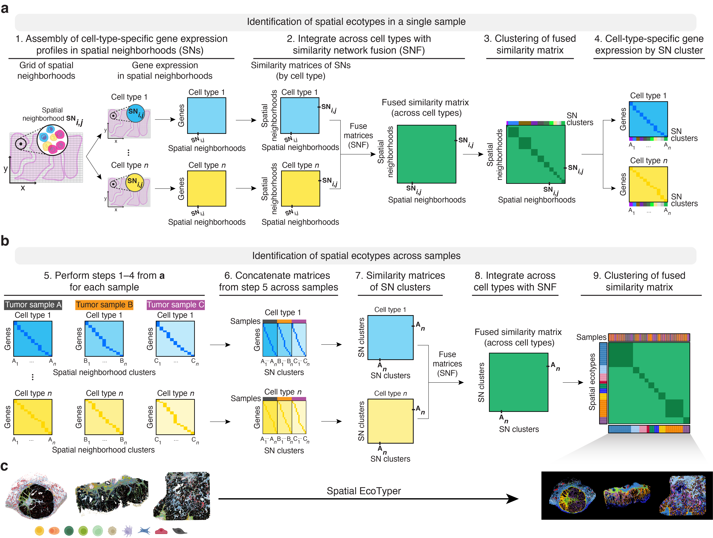
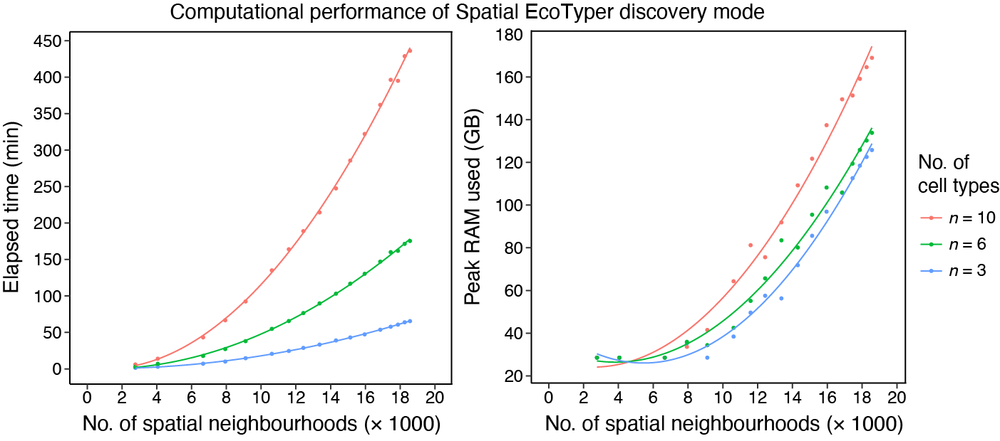

```{r setup, include=FALSE}
knitr::opts_chunk$set(echo = TRUE, warning = FALSE, message = FALSE)
```

# Overview

In this tutorial, we will illustrate how to identify conserved spatial ecotypes (SEs) across multiple single-cell spatial transcriptomics (ST) datasets using the SpatialEcoTyper framework. 

```{r workflow, out.width = '100%', echo=FALSE}

```

The analysis is performed in two stages:

-   **Determination of sample-level spatial clusters** (Steps 1-4): Spatial neighborhood clusters from each single-cell ST sample can be identified using the [SpatialEcoTyper](../reference/SpatialEcoTyper.html) function. Check [Tutorial 1](SingleSample.html) for details.
-   **Identification of conserved spatial ecotypes** (Steps 5-9): Spatial neighborhood clusters discovered from individual single-cell ST samples are represented by gene expression profiles (GEPs) of their associated cell states, and clusters with similar GEPs are aggregated across samples to identify conserved SEs.


# Input requirement

All single-cell-scale ST datasets can be used to discover spatial ecotypes. In our study ([Zhang et al., Nature](https://www.nature.com/articles/s41586-026-10452-4)), we applied SpatialEcoTyper to both MERSCOPE and Xenium datasets and identified highly consistent pan-cancer spatial ecotypes across the two platforms.

Single-cell ST gene expression profiles are inherently affected by transcript spillover. In our study, we addressed this issue by constructing a whitelist of genes expressed in each cell type using a pan-cancer scRNA-seq atlas and removing transcripts that were not included in the corresponding cell-type whitelist. Alternatively, computational methods such as [SPLIT](https://github.com/bdsc-tds/SPLIT) have been developed to decontaminate single-cell ST data by correcting transcript spillover. We recommend applying either a whitelist-based filtering strategy or a dedicated decontamination method before SE discovery, as improving data quality can substantially enhance the robustness and biological interpretability of the discovered spatial ecotypes.

# Example data

For the demonstration of the integrative analysis of multiple single-cell ST samples, we have selected a subset of regions from a melanoma sample and a colon cancer sample profiled by Vizgen MERSCOPE. 

The melanoma sample includes spatial expression data for 500 genes across 27,907 cells, while the colon cancer sample contains data for 38,080 cells. In both samples, cells were categorized into ten distinct cell types: B cells, CD4 T cells, CD8 T cells, NK cells, plasma cells, macrophages, dendritic cells (DC), fibroblasts, endothelial cells, and cancer cells. Cancer cells are excluded from this demonstration to reduce processing time.

All cells are grouped into tumor (tumor and inner margin) and stroma regions (stroma and outer margin) based on the density of cancer cells, as described in the [CytoSPACE paper](https://www.nature.com/articles/s41587-023-01697-9). The inner and outer margins are defined as regions extending 250 μm inside and outside the tumor boundaries, respectively.

__Load required packages for this vignette__

```{r lib}
suppressPackageStartupMessages(library(dplyr))
suppressPackageStartupMessages(library(ggplot2))
suppressPackageStartupMessages(library(parallel))
suppressPackageStartupMessages(library(Seurat))
suppressPackageStartupMessages(library(data.table))
suppressPackageStartupMessages(library(NMF))
suppressPackageStartupMessages(library(ComplexHeatmap))
library(SpatialEcoTyper)
```

# Start with SpatialEcoTyper results from individual single-cell ST samples

Multiple samples can be integrated to identify conserved spatial ecotypes using [IntegrateSpatialEcoTyper](../reference/IntegrateSpatialEcoTyper.html). Before integration, each sample must be analyzed individually following [Tutorial 1](SingleSample.html) using identical analysis settings. To ensure robust integration, cell types included in the analysis should present in more than 50% of the samples.

This [IntegrateSpatialEcoTyper](../reference/IntegrateSpatialEcoTyper.html) function requires two input data objects per sample:

* __Gene expression matrix__: a numeric matrix with genes as rows and cells as columns. The data should be already analyzed with [SpatialEcoTyper](../reference/SpatialEcoTyper.html).

* __[SpatialEcoTyper](../reference/SpatialEcoTyper.html) output__: a list object obtained from single-sample analysis with [SpatialEcoTyper](../reference/SpatialEcoTyper.html). If you don't have the results yet, please follow [Tutorial 1](SingleSample.html) for the analysis.


Load the demo data

```{r downloadse}
url <- "https://spatialecotyper.stanford.edu/inc/inc.public.vignettes.php?file=CRC2_subset_SpatialEcoTyper_results.rds"
download.file(url, destfile = "CRC2_subset_SpatialEcoTyper_results.rds", mode = "wb")
url <- "https://spatialecotyper.stanford.edu/inc/inc.public.vignettes.php?file=Melanoma1_subset_SpatialEcoTyper_results.rds"
download.file(url, destfile = "Melanoma1_subset_SpatialEcoTyper_results.rds", mode = "wb")
```


```{r loaddata}
# Load single-cell gene expression data. Rows represent gene names and columns represent cell IDs
scdata1 <- fread("https://spatialecotyper.stanford.edu/inc/inc.public.vignettes.php?file=Melanoma1_subset_counts.tsv.gz",
                sep = "\t", header = TRUE, data.table = FALSE)
rownames(scdata1) <- scdata1[, 1]  # Setting the first column as row names
scdata1 <- as.matrix(scdata1[, -1]) # Dropping first column

scdata2 <- fread("https://spatialecotyper.stanford.edu/inc/inc.public.vignettes.php?file=CRC2_subset_counts.tsv.gz",
                sep = "\t", header = TRUE, data.table = FALSE)
rownames(scdata2) <- scdata2[, 1] # Setting the first column as row names
scdata2 <- as.matrix(scdata2[, -1]) # Dropping first column
head(scdata1[,1:5])
# head(scdata2[,1:5])

## Normalize the data as needed
normdata1 <- NormalizeData(scdata1)
normdata2 <- NormalizeData(scdata2)

data_list <- list(SKCM = normdata1, CRC = normdata2)
SpatialEcoTyper_results_list <- list(SKCM = readRDS("Melanoma1_subset_SpatialEcoTyper_results.rds"),
                             CRC = readRDS("CRC2_subset_SpatialEcoTyper_results.rds"))
```


```{r integrate, eval = TRUE}
IntegrateSpatialEcoTyper(SpatialEcoTyper_results_list, data_list, 
                         outdir = "SpatialEcoTyper_results/",
                         normalization.method = "None", 
                         nfeatures = 300, # Number of top variable genes to use
                         nmf_ranks = 4:15, # Number of clusters to test
                         nrun.per.rank = 10,  # recommend 30 or higher for robust results
                         ncores = 16)
```

__Choosing the optimal number of SEs__: NMF clustering is used to identify conserved spatial ecotypes across samples. To determine the optimal number of SEs, users can specify the `nmf_ranks` and `nrun.per.rank` arguments to evaluate multiple candidate ranks, each with a defined number of runs (we recommend ≥30 runs per rank to ensure robustness, as NMF uses random initialization). For each rank, the cophenetic coefficient is computed to assess clustering stability. This metric ranges from 0 to 1, with higher values indicating greater stability. Typically, the cophenetic coefficient exhibits a multi-modal pattern across ranks, and we selected the optimal number of SEs as the highest rank at which the cophenetic coefficient exceeds 0.95 (controlled by the `min.coph` argument) and is followed by the largest subsequent decrease, indicating a transition to less stable solutions.

__Balancing predefined regions__: If predefined tissue regions are available (e.g., pathologist annotations of tumor and adjacent stromal regions), you can use the `Region` and `downsample.by.region` argument to balance spatial neighborhoods across regions. When enabled, the method downsamples neighborhoods within each region to ensure comparable representation and to weight regions equally during integration.

# Start with raw single-cell ST data from multiple samples

The [MultiSpatialEcoTyper](../reference/MultiSpatialEcoTyper.html) function provides an end-to-end pipeline for the integrative analysis of single-cell spatial transcriptomics data across multiple samples. While this streamlined workflow is convenient, it can be computationally intensive. Therefore, we recommend first analyzing each sample individually using the [SpatialEcoTyper](../reference/SpatialEcoTyper.html) function, as demonstrated in [Tutorial 1](SingleSample.html). The resulting outputs can then be integrated across samples using the [IntegrateSpatialEcoTyper](../reference/IntegrateSpatialEcoTyper.html) function, as described above.

The [MultiSpatialEcoTyper](../reference/MultiSpatialEcoTyper.html) requires two input data objects per sample:

* __Gene expression matrix__: a numeric matrix with genes as rows and cells as columns.
* __Metadata__: a data frame containing at least three columns: "X" (x-coordinate), "Y" (y-coordinate), and "CellType" (cell type annotation). Row names must match the column names (cell IDs) in the expression matrix.


First, load single-cell gene expression data and meta data for the two example samples.
```{r loaddata2}
# Load single-cell gene expression data. Rows represent gene names and columns represent cell IDs
scdata1 <- fread("https://spatialecotyper.stanford.edu/inc/inc.public.vignettes.php?file=Melanoma1_subset_counts.tsv.gz",
                sep = "\t", header = TRUE, data.table = FALSE)
rownames(scdata1) <- scdata1[, 1]  # Setting the first column as row names
scdata1 <- as.matrix(scdata1[, -1]) # Dropping first column

scdata2 <- fread("https://spatialecotyper.stanford.edu/inc/inc.public.vignettes.php?file=CRC2_subset_counts.tsv.gz",
                sep = "\t", header = TRUE, data.table = FALSE)
rownames(scdata2) <- scdata2[, 1] # Setting the first column as row names
scdata2 <- as.matrix(scdata2[, -1]) # Dropping first column
head(scdata1[,1:5])
# head(scdata2[,1:5])

# Load single-cell metadata
# Row names should be cell ids. Required columns: X, Y, CellType; 
# Recommend a 'Region' column if region annotations are available
scmeta1 <- read.table("https://spatialecotyper.stanford.edu/inc/inc.public.vignettes.php?file=Melanoma1_subset_scmeta.tsv",
                      sep = "\t", header = TRUE, row.names = 1)
scmeta2 <- read.table("https://spatialecotyper.stanford.edu/inc/inc.public.vignettes.php?file=CRC2_subset_scmeta.tsv",
                      sep = "\t", header = TRUE, row.names = 1)
head(scmeta1[, c("X", "Y", "CellType", "Region")])
head(scmeta2[, c("X", "Y", "CellType", "Region")])

# Make sure row names of the meta data match column names of the gene expression matrix
scdata1 <- scdata1[, match(rownames(scmeta1), colnames(scdata1))]
scdata2 <- scdata2[, match(rownames(scmeta2), colnames(scdata2))]

## Normalize the data as needed
normdata1 <- NormalizeData(scdata1)
normdata2 <- NormalizeData(scdata2)
```

You can then submit the job. As this step is computationally intensive, refer to the section below for the recommended memory allocation and estimated runtime requirements.

```{r multi, eval=FALSE}
data_list <- list(SKCM = normdata1, CRC = normdata2)
metadata_list <- list(SKCM = scmeta1, CRC = scmeta2)
MultiSpatialEcoTyper(data_list, metadata_list, 
                     normalization.method = "None", # Normalization method
                     nfeatures = 300,
                     nmf_ranks = 4:15,  # Number of clusters
                     nrun.per.rank = 30,  # Recommend 30 or higher for robust results
                     ncores = 2)
```

<details><summary><strong>Optimizing memory usage</strong></summary>

The similarity network fusion (Step 2 of SpatialEcoTyper) is the most computationally demanding step, and its runtime increases with the number of spatial neighborhoods (SNs) per sample.

```{r resource, out.width = '100%', echo=FALSE}

```
For example, an analysis involving 10 cell types and 18,564 SNs required 436 minutes of runtime and reached a peak memory usage of 169 GB. This benchmark was obtained on a computing cluster equipped with an AMD EPYC 7543 processor (2.75 GHz) and 256 GB RAM, using a single CPU core and excluding data loading time.

To reduce runtime, users can increase the number of cores via the `ncores` parameter. However, this parallelization comes at the cost of increased memory consumption.

When memory resources are limited, users can reduce the number of spatial neighborhoods by increasing `grid.size`, which makes the spatial grid coarser. Increasing `radius` can also reduce the number of unique SNs, but it changes spatial resolution and should be used carefully.

</details>


# Output results

All results will be saved in the specified directory (`outdir`). The output files include:

-   **`(SampleName)_SpatialEcoTyper_results.rds`** `SpatialEcoTyper` result for each sample (if `MultiSpatialEcoTyper` function was used).
-   **MultiSE_integrated_final.rds** A matrix representing the fused similarity matrix of spatial clusters across all samples.
-   **MultiSE_integrated_final_hmap.pdf** A heatmap visualizing the fused similarity matrix of spatial clusters, grouped by samples and SEs.
-   **MultiSE_metadata_final.rds** Single-cell metadata with an 'SE' column annotating the discovered SEs, saved as an RDS file.
-   **MultiSE_metadata_final.tsv** The same as `MultiSE_metadata_final.rds`, but saved in TSV format.
-   **SpatialView_SEs_by_Sample.pdf** A figure showing the spatial landscape of SEs across samples.
-   **BarView_SEs_Sample_Frac.pdf** A bar plot showing the fraction of cells from each sample represented within each SE.
-   **BarView_SEs_Region_Frac_Avg.pdf** A bar plot showing the average fraction of regions represented within each SE.
-   **BarView_SEs_CellType_Frac_Avg.pdf** A bar plot showing the average cell type composition within each SE.
-   **MultiSE_NMF_results.rds** The NMF result derived from the `nmfClustering` function. If a single rank was provided, it contains an `NMFfitX1` object . If multiple ranks were provided, it is a `list` containing the optimal number of communities (`bestK`), a list of `NMFfitX1` objects (`NMFfits`), and a `ggplot` object (`p`) displaying the cophenetic coefficient for different cluster numbers.
-   **MultiSE_NMF_Cophenetic_Dynamics.pdf** A figure showing the cophenetic coefficients for different numbers of clusters, only available when multiple ranks were provided.


# Identifying a different number of spatial ecotypes

**SpatialEcoTyper** uses NMF to group spatial clusters from multiple samples into conserved SEs. If you want to try a different number of clusters for spatial ecotype identification, you can use the [nmfClustering](../reference/nmfClustering.html) function.

This analysis requires the fused similarity network matrix (`MultiSE_integrated_final.rds`) generated from previous step.

```{r loadintegrated, eval=TRUE}
## Fused similarity matrix of spatial clusters across all samples
outdir = "SpatialEcoTyper_results/"
integrated = readRDS(file.path(outdir, "MultiSE_integrated_final.rds"))
dim(integrated)

## Single-cell metadata with an 'SE' column annotating the discovered SEs
# Column InitSE: Sample-level spatial clusters (before integration)
# Column SE: Conserved spatial ecotypes (after cross-sample integration)
finalmeta = readRDS(file.path(outdir, "MultiSE_metadata_final.rds"))
head(finalmeta[, c("Sample", "X", "Y", "CellType", "Region", "InitSE", "SE")])
```

For instance, if you want to identify 10 SEs, you can specific `ranks = 10` to identify 10 clusters.
```{r updaterank, eval=FALSE}
nmf_res <- nmfClustering(integrated, ranks = 10, nrun.per.rank = 30, 
                         seed = 1, ncores = 8)
ses <- predict(nmf_res)

## Add the newly defined SEs into the meta data
finalmeta$SE = paste0("SE", ses[finalmeta$InitSE])
head(finalmeta)
```

<details><summary><strong>Determining the optimal number of clusters</strong></summary>

To determine the optimal number of clusters, you can provide multiple candidate values to the `ranks` argument in the [nmfClustering](../reference/nmfClustering.html) function, which evaluates each specified rank and computes the corresponding cophenetic coefficient to assess clustering stability. Running time for this step could be time-consuming, and the time requirement is dependent on the data size, the number of ranks to test, the number of runs per rank, and the number of cores for parallel analysis.

```{r nmfcluster, eval=FALSE}
nmf_res <- nmfClustering(integrated, ranks = 2:30,
                         nrun.per.rank = 30, # Recommend 30 or higher
                         min.coph = 0.95,
                         ncores = 4,
                         seed = 1)
paste0("The selected rank is ", nmf_res$bestK)
## Visualize the change of cophenetic coefficient across ranks
plot(nmf_res$p)
```

Once the optimal rank is determined, you can use it to generate the final SE annotations.

```{r nmfresult, eval=FALSE}
## Extract new clustering results
ses <- predict(nmf_res$NMFfits[[paste0("K.", nmf_res$bestK)]])

## Add the newly defined SEs into the meta data
finalmeta$SE = paste0("SE", ses[finalmeta$InitSE])
head(finalmeta)
```

</details>

# Visualizing SEs

## Visualizing the integrated similarity matrix

After updating the NMF clustering results, you can re-order spatial clusters across samples and visualize the fused similarity matrix on a heatmap.

```{r newsehmap}
# Order SN clusters by SEs
tmpmeta = finalmeta %>% filter(!is.na(SE)) %>% arrange(SE) %>% 
    distinct(InitSE, .keep_all = TRUE) %>% as.data.frame
rownames(tmpmeta) = tmpmeta$InitSE
integrated = integrated[tmpmeta$InitSE, tmpmeta$InitSE]
# Annotation
ann <- tmpmeta[, c("Sample", "SE")]
SE_cols <- getColors(length(unique(ann$SE)), palette = 1) # colors for SEs
names(SE_cols) <- unique(ann$SE)
sample_cols <- getColors(length(unique(ann$Sample)), palette = 2) # colors for samples
names(sample_cols) <- unique(ann$Sample)

## draw heatmap
p = HeatmapView(integrated, show_row_names = FALSE, show_column_names = FALSE,
            top_ann = ann, top_ann_col = list(Sample = sample_cols, SE = SE_cols))
p = ComplexHeatmap::draw(p)
drawRectangleAnnotation(p, ann$SE, ann$SE)
```

## Visualizing SEs in the tissue

The spatial distribution of SEs within the tissue can be visualized using the [SpatialView](../reference/SpatialView.html) function.

```{r spatialmapse, fig.height=3}
SpatialView(finalmeta, by = "SE")  + facet_wrap(~Sample, scales = "free")
```

## Association between SEs and pre-annotated regions

This bar plot shows the enrichment of SEs in pre-defined regions (e.g., tumor and stroma).

```{r bar_region1}
gg <- finalmeta %>% filter(!is.na(SE)) %>% count(SE, Region, Sample) %>% 
    group_by(Sample, SE) %>% mutate(Frac = n / sum(n)) %>% ## cell type fractions within each sample
    group_by(SE, Region) %>% summarise(Frac = mean(Frac)) ## average cell type fractions across all samples
ggplot(gg, aes(SE, Frac, fill = Region)) + 
  geom_bar(stat = "identity", position = "fill") + 
  scale_fill_brewer(type = "qual", palette = "Set1") +
  theme_bw(base_size = 14) + coord_flip() + 
  labs(y = "Fraction")
```

<details><summary><strong>Association between SEs and pre-annotated regions within each sample</strong></summary>
```{r bar_region2}
gg <- finalmeta %>% filter(!is.na(SE)) %>% count(SE, Region, Sample)

ggplot(gg, aes(SE, n, fill = Region)) + 
  geom_bar(stat = "identity", position = "fill") + 
  scale_fill_brewer(type = "qual", palette = "Set1") +
  facet_wrap(~Sample) +
  theme_bw(base_size = 14) + coord_flip() + 
  labs(y = "Fraction of regions")
```
</details>


## Cell type composition of SEs

We can visualize the cell type composition of SEs in a bar plot. The cell type fractions can be averaged across the two samples.

__Average cell type composition of SEs across all samples__
```{r bar_ct2}
gg <- finalmeta %>% filter(!is.na(SE)) %>% count(SE, CellType, Sample) %>% 
    group_by(Sample, SE) %>% mutate(Frac = n / sum(n)) %>% ## cell type fractions within each sample
    group_by(SE, CellType) %>% summarise(Frac = mean(Frac)) ## average cell type fractions across all samples

ggplot(gg, aes(SE, Frac, fill = CellType)) + 
  geom_bar(stat = "identity", position = "fill") +
  scale_fill_manual(values = pals::cols25()) +
  theme_bw(base_size = 14) + coord_flip() + 
  labs(y = "Cell type abundance")
```

<details><summary><strong>Cell type composition of SEs within each sample</strong></summary>
```{r bar_ct1}
gg <- finalmeta %>% filter(!is.na(SE)) %>% count(SE, CellType, Sample)

ggplot(gg, aes(SE, n, fill = CellType)) + 
  geom_bar(stat = "identity", position = "fill") +
  scale_fill_manual(values = pals::cols25()) +
  facet_wrap(~Sample) +
  theme_bw(base_size = 14) + coord_flip() + 
  labs(y = "Cell type abundance")
```
</details>

## Distance of SEs to tumor/stroma interface

This box plot visualizes the distribution of distances of SEs to the tumor/stroma interface. Positive distances indicate cells located within the tumor region, while negative distances denote cells within the stroma. The SEs are ordered by their median distance, highlighting their spatial localization relative to the tumor/stroma interface.

```{r box_dist}
gg <- finalmeta %>% filter(!is.na(SE)) %>% group_by(Sample, SE) %>% 
  summarise(Dist2Interface = mean(Dist2Interface)) %>% arrange(Dist2Interface)
gg$SE = factor(gg$SE, levels = unique(gg$SE))
ggplot(gg, aes(SE, Dist2Interface)) + geom_boxplot() + 
  geom_point(aes(color = Sample)) + theme_bw() + 
  labs(y = "Distance to tumor/stroma interface (μm)")
```


# Identification of cell-type-specific SE markers

Cell-type-specific SE markers can be identified by differential expression analysis using the [`presto` package](https://github.com/immunogenomics/presto). In our study ([Zhang et al., Nature](https://www.nature.com/articles/s41586-026-10452-4)), we extended marker discovery to the whole transcriptome by developing an SE recovery model (see [Tutorial 3](TrainRecoveryModel.html) and [Tutorial 4](Discovery_SE_CellStates.html)). This model was applied to annotate SEs in pan-cancer scRNA-seq datasets (see [Tutorial 6](Recovery_scRNA.html)), after which differential expression analysis was performed on the annotated scRNA-seq data to identify both cell-type-specific and consensus SE markers.

## DE analysis within each sample

Here is an example of how to identify fibroblast-specific markers for each SE.

```{r deg}
require("presto")
## DE analysis within the first sample
tmpmeta1 = finalmeta %>% filter(CellType=="Fibroblast" & Sample=="SKCM" & (!is.na(SE)))
tmpdata1 = normdata1[, tmpmeta1$CID]
degs1 = wilcoxauc(tmpdata1, tmpmeta1$SE)
## DE analysis within the second sample
tmpmeta2 = finalmeta %>% filter(CellType=="Fibroblast" & Sample=="CRC" & (!is.na(SE)))
tmpdata2 = normdata2[, tmpmeta2$CID]
degs2 = wilcoxauc(tmpdata2, tmpmeta2$SE) # DE analysis

head(degs1)
head(degs2)
```

## Identifying conserved markers across samples

To identify markers conserved across different samples, we conduct a meta-analysis by averaging the log2 fold changes (log2FC) from the DE analyses.

```{r metadeg}
library(tidyr)
degs <- merge(degs1[, c(1,2,4)], degs2[, c(1,2,4)], by = c("feature", "group"))
degs$AvgLogFC = (degs$logFC.x + degs$logFC.y) / 2
lfcs = degs %>% pivot_wider(id_cols = feature, names_from = group, 
                            values_from = AvgLogFC) %>% as.data.frame
rownames(lfcs) <- lfcs$feature
lfcs <- lfcs[, -1]
head(lfcs)
```

To identify markers that are specific to each SE-associated cell state, we calculate the difference between the maximum log2FC for each gene and the second-highest log2FC:

```{r metadeg2}
secondmax = apply(lfcs, 1, function(x){ -sort(-x)[2] })
delta = lfcs - secondmax
idx = delta>0 & lfcs>0.05
markers = lapply(colnames(lfcs), function(se){
  gs = rownames(idx)[idx[, se]]
  gs = gs[order(-lfcs[gs, se])]
  gs
})
names(markers) = colnames(lfcs)
markers = markers[lengths(markers)>0]
## Select the top five markers
top5 = lapply(markers, function(x){ x[1:min(5, length(x))] })
top5
```

## Visualizing top SE cell state markers

```{r hmaptop, fig.height=7}
gg = t(scale(t(lfcs[unlist(top5), ]), center = FALSE))
HeatmapView(gg, breaks = c(0, 1, 1.5))
```

# Next step

Following spatial ecotype discovery, users can [identify SE-specific cell states via leave-one-sample-out cross-validation](Discovery_SE_CellStates.html) and [develop machine learning models to enable SE recovery from held-out single-cell datasets (e.g., scRNA-seq or single-cell spatial transcriptomics)](TrainRecoveryModel.html).

# Session info

The session info allows users to replicate the exact environment and identify potential discrepancies in package versions or configurations that might be causing problems.

```{r session}
sessionInfo()
```

