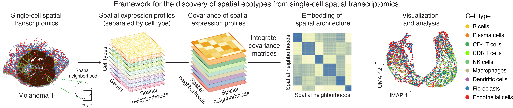

```{r setup, include=FALSE}
knitr::opts_chunk$set(echo = TRUE, warning = FALSE, message = FALSE)
```

# Overview

In this tutorial, we will illustrate how to perform de novo discovery of spatial ecotypes from single-cell spatial transcriptomics dataset using [SpatialEcoTyper](../reference/SpatialEcoTyper.html).

We will be analyzing single-cell spatial transcriptomics data from a melanoma sample (raw data available in [Vizgen's MERSCOPE FFPE Human Immuno-oncology](https://vizgen.com/data-release-program/)). To quickly demonstrate how [SpatialEcoTyper](../reference/SpatialEcoTyper.html) works, we've selected a subset of the sample, which can be downloaded from [`here`](https://drive.google.com/drive/folders/17K5XR7VEvxN9walV4RtaLOR2cBRG-aMh?usp=drive_link).

This demo data comprises the spatial expression of 500 genes across 27,907 cells, which are categorized into ten distinct cell types: B cells, CD4+ T cells, CD8+ T cells, NK cells, plasma cells, macrophages, dendritic cells (DC), fibroblasts, endothelial cells, and melanoma cells. Melanoma cells are excluded from this demonstration to reduce processing time.

All cells are grouped into four spatial regions: tumor, inner margin, outer margin, and stroma. The tumor and stroma regions are defined based on the density of cancer cells, as described in the [CytoSPACE paper](https://www.nature.com/articles/s41587-023-01697-9). The inner and outer margins are defined as regions extending 250 μm inside and outside the tumor boundaries, respectively. Furthermore, we quantified each cell’s distance to the tumor–stroma interface by calculating the shortest Euclidean distance to the nearest tumor region (for stromal cells) or stromal region (for tumor cells). A positive distance indicates cells located within the tumor region, while a negative distance indicates cells located within the stroma.

[SpatialEcoTyper](../reference/SpatialEcoTyper.html) analysis requires two input data:

* __gene expression matrix__: rows represent gene names and columns represent cell IDs
* __meta data__: a data frame with at least three columns, including "X" (X-coordinate), "Y" (Y-coordinate), and "CellType" (the cell type annotation). The row names of the meta data should match the column names (cell IDs) in the expression matrix.


__First load required packages for this vignette__

```{r lib}
suppressPackageStartupMessages(library(dplyr))
suppressPackageStartupMessages(library(ggplot2))
suppressPackageStartupMessages(library(parallel))
suppressPackageStartupMessages(library(Seurat))
suppressPackageStartupMessages(library(data.table))
suppressPackageStartupMessages(library(googledrive))
suppressPackageStartupMessages(library(R.utils))

library(SpatialEcoTyper)
```

# Quick start
```{r download1, eval=FALSE}
## Download an example data for the analysis
drive_deauth() # Disable Google sign-in requirement
drive_download(as_id("13Rc5Rsu8jbnEYYfUse-xQ7ges51LcI7n"), "HumanMelanomaPatient1_subset_counts.tsv.gz", overwrite = TRUE)
drive_download(as_id("12xcZNhpT-xbhcG8kX1QAdTeM9TKeFAUW"), "HumanMelanomaPatient1_subset_scmeta.tsv", overwrite = TRUE)

## Load the gene expression matrix
scdata <- fread("HumanMelanomaPatient1_subset_counts.tsv.gz", 
                sep = "\t",header = TRUE, data.table = FALSE)
rownames(scdata) <- scdata[, 1]
scdata <- as.matrix(scdata[, -1])

## Normalize the gene expression data
normdata <- NormalizeData(scdata)

## Load the spatial coordinates and cell type annotation of single cells
scmeta <- read.table("HumanMelanomaPatient1_subset_scmeta.tsv", 
                      sep = "\t",header = TRUE, row.names = 1)
scmeta <- scmeta[match(colnames(scdata), rownames(scmeta)), ]

## Discover spatial ecotypes using the SpatialEcoTyper
se_results <- SpatialEcoTyper(normdata, scmeta, 
                              outprefix = "Melanoma1_subset",
                              radius = 50, ncores = 2)
```


# Loading data

<details open><summary><strong>Text files as input</strong></summary>

Download the data from Google Drive
```{r download2, eval=FALSE}
drive_deauth() # Disable Google sign-in requirement
drive_download(as_id("13Rc5Rsu8jbnEYYfUse-xQ7ges51LcI7n"), "HumanMelanomaPatient1_subset_counts.tsv.gz", overwrite = TRUE)
drive_download(as_id("12xcZNhpT-xbhcG8kX1QAdTeM9TKeFAUW"), "HumanMelanomaPatient1_subset_scmeta.tsv", overwrite = TRUE)
```

Large text files can be loaded into R using the `fread` function from the `data.table` package.
```{r text, eval = TRUE}
# Load single-cell gene expression matrix. Rows represent gene names and columns represent cell IDs
scdata <- fread("HumanMelanomaPatient1_subset_counts.tsv.gz", 
                sep = "\t",header = TRUE, data.table = FALSE)
rownames(scdata) <- scdata[, 1]  # Setting the first column as row names
scdata <- as.matrix(scdata[, -1]) # Dropping first column
head(scdata[, 1:5])

# Load single-cell metadata
# Three columns are required, including "X", "Y", and "CellType"
# The row names should match the cell ids in the expression matrix
scmeta <- read.table("HumanMelanomaPatient1_subset_scmeta.tsv", 
                      sep = "\t",header = TRUE, row.names = 1)
scmeta <- scmeta[match(colnames(scdata), rownames(scmeta)), ] # match the cell ids in scdata and scmeta
head(scmeta[, c("X", "Y", "CellType")])
```
</details>


<details><summary><strong>Sparse matrix as input</strong></summary>

[SpatialEcoTyper](../reference/SpatialEcoTyper.html) supports sparse matrix as input. Mtx files can be loaded into R using the [`ReadMtx`](https://satijalab.org/seurat/reference/readmtx) function from the Seurat package.

```{r readmtx, eval = FALSE}
drive_download(as_id("13M3xhRxp0xK9gf5F4DE9idSBFqVQIXDT"), "HumanMelanomaPatient1_subset_counts.mtx.gz", overwrite = TRUE)
drive_download(as_id("136feRaFjMtNvduLTm5xqa3WhyyoG4Xzo"), "HumanMelanomaPatient1_subset_cells.tsv.gz", overwrite = TRUE)
drive_download(as_id("13QprWzJhzzUy_w3XSrjlt9pjf2n-G7HV"), "HumanMelanomaPatient1_subset_genes.tsv.gz", overwrite = TRUE)

scdata <- ReadMtx(mtx = "HumanMelanomaPatient1_subset_counts.mtx.gz", 
                  cells = "HumanMelanomaPatient1_subset_cells.tsv.gz", 
                  features = "HumanMelanomaPatient1_subset_genes.tsv.gz",
                  feature.column = 1, cell.column = 1)
```
</details>

# Data normalization

The gene expression data should be normalized before [SpatialEcoTyper](../reference/SpatialEcoTyper.html) analysis. The data can be normalized using  [NormalizeData](https://satijalab.org/seurat/reference/normalizedata) or [SCTransform](https://satijalab.org/seurat/articles/seurat5_spatial_vignette_2).

Here, we are normalizing using SCTransform normalization. We recommend to install the glmGamPoi package for faster computation.
```{r SCTransform, eval = TRUE}
if(!"glmGamPoi" %in% installed.packages()){
  BiocManager::install("glmGamPoi")
}
tmpobj <- CreateSeuratObject(scdata) %>%
      SCTransform(clip.range = c(-10, 10), verbose = FALSE)

seurat_version = as.integer(gsub("\\..*", "", as.character(packageVersion("SeuratObject"))))
if(seurat_version<5){
  normdata <- GetAssayData(tmpobj, "data")
}else{
  normdata <- tmpobj[["SCT"]]$data
}
```

<details><summary><strong>Using `NormalizeData` for the normalization:</strong></summary>

```{r NormalizeData, eval = FALSE}
normdata <- NormalizeData(scdata)
```
</details>

# Preview of the sample

The [SpatialView](../reference/SpatialView.html) function can be used to visualize single cells within the tissue. You can color the cells by cell type or predefined spatial regions.

```{r viewct}
# Visualize the cell type annotations in the tissue
SpatialView(scmeta, by = "CellType") + scale_color_manual(values = pals::cols25())
```

```{r viewregion}
# Visualize the regions in the tissue
SpatialView(scmeta, by = "Region") + scale_color_brewer(type = "qual", palette = "Set1")
```

The [SpatialView](../reference/SpatialView.html) function can also be used to visualize continuous characteristics, such as the minimum distance of each single cell to tumor/stroma margin. Here, positive distances indicate cells located within the tumor region, while negative distances denote cells within the stroma. 

```{r viewdist}
# Visualize the distance to tumor margin
SpatialView(scmeta, by = "Dist2Interface") + 
  scale_colour_gradient2(low = "#5e3c99", high = "#e66101", 
                         mid = "#d9d9d9", midpoint = 0) + 
  labs(color = "Distance to\ntumor margin")
```


# SE discovery using SpatialEcoTyper
```{r workflow, out.width = '100%', echo=FALSE}

```

The [SpatialEcoTyper](../reference/SpatialEcoTyper.html) function is designed to identify spatial ecotypes (SEs) from single-cell spatial transcriptomics data. The workflow begins by defining spatial neighborhoods (SNs) on a regular grid and constructing cell type–specific gene expression profiles (GEPs) for each SN. For each cell type, a similarity network is then generated based on these GEPs, where nodes represent SNs and edges denote their expression similarity.  To integrate these networks across cell types, SpatialEcoTyper applies the Similarity Network Fusion (SNF) method, originally developed for multi-omics data integration ([Wang et al., 2014](https://www.nature.com/articles/nmeth.2810)). This yields a fused similarity network that captures shared spatial transcriptomic variation across cell types, enabling the identification of SEs through clustering.

<details open><summary><strong>Key arguments for SpatialEcoTyper</strong></summary>

-   `normdata` A matrix representing normalized gene expression data, where rows correspond to genes and columns correspond to cells.
-   `metadata` A data frame containing metadata associated with each cell. Must include spatial coordinates (e.g., X and Y) as well as cell type annotations. The row names must match the column names of the `normdata`.
-   `outprefix` Character string specifying the prefix for output file names.
-   `radius` Numeric specifying the radius (default: 50 µm) for defining spatial neighborhood.
-   `grid.size` Numeric specifying the grid size for spatial discretization of coordinates.
-   `resolution` Numeric specifying the resolution for Louvain clustering (default: 0.5).
-   `nfeatures` Integer specifying the number of top variable features (default: 500) used for the analysis.
-   `min.cts.per.region`  Integer specifying the minimum number of cell types (default: 2) required for a spatial neighborhood. 
-   `iterations` Integer specifying the number of iterations (default: 10) for SNF analysis.
-   `ncores` Integer specifying the number of CPU cores to use for parallel processing.

You can type `?SpatialEcoTyper` to visualize the full manual.

</details>

```{r snf, eval = TRUE}
## This step takes ~2 minutes to complete on macOS with an Apple M1 Pro chip and 16 GB memory.
se_results <- SpatialEcoTyper(normdata, scmeta,
                              outprefix = "Melanoma1_subset",
                              radius = 50, ncores = 2)
```

<details><summary><strong>Optimizing memory usage</strong></summary>
For large single-cell spatial transcriptomics (ST) datasets with more than 100,000 cells, the analysis can be both time- and memory-intensive. To accelerate computation, you can increase the number of cores used (`ncores`), but this will also increase memory consumption.

If computational memory is limited, several strategies can help reduce usage. One option is to increase the `grid.size`, which decreases the number of spatial neighborhoods and can substantially decrease memory usage. Another option is to reduce the `minibatch` size and the number of cores (`ncores`). However, the minimum memory requirement may still remain high for very large datasets.

</details>

<details><summary><strong>Interested in multicellular communities associated with specific cell types?</strong></summary>

If you’re interested in investigating multicellular communities associated with specific cell types, you can use the `filter.region.by.celltypes` argument to limit the analysis to spatial neighborhoods that contain at least one cell of the specified type. For example, to identify SEs associated with CD8 T cells, you can use the following command:
```{r snf2, eval = FALSE}
se_results <- SpatialEcoTyper(normdata, scmeta,
                              outprefix = "Melanoma1_subset",
                              radius = 50, ncores = 2,
                              filter.region.by.celltypes = c("CD8T"))
```
</details>

<details><summary><strong>Interested in regions with multiple cell types?</strong></summary>

If you’re interested in regions composed of multiple cell types, you can use the `min.cts.per.region` argument to restrict the analysis to spatial neighborhoods containing at least the specified minimum number of distinct cell types.

```{r snf3, eval = FALSE}
se_results <- SpatialEcoTyper(normdata, scmeta,
                              outprefix = "Melanoma1_subset",
                              radius = 50, ncores = 2,
                              min.cts.per.region = 2)
```
</details>

# SpatialEcoTyper result

When the `outprefix` is specified, the [SpatialEcoTyper](../reference/SpatialEcoTyper.html) result will be saved as a RDS file named `outprefix_SpatialEcoTyper_results.rds`. The result can be loaded into R using `readRDS`.
```{r loadres, eval=FALSE}
## drive_download(as_id("13T8IIbgk26sokFI8F3VqI4mvz3QIp3fT"), "Melanoma1_subset_SpatialEcoTyper_results.rds", overwrite = TRUE)
se_results <- readRDS("Melanoma1_subset_SpatialEcoTyper_results.rds")
```

The [SpatialEcoTyper](../reference/SpatialEcoTyper.html) result is a list that includes two key components: 

* __a Seurat object__ constructed from the fused network embedding of spatial neighborhoods, enabling the identification of spatial ecotypes through clustering. 
* __a data frame of the single-cell metadata__, which includes the original single-cell metadata with spatial ecotype cluster annotations added.

```{r seres}
# Extract the Seurat object and updated single-cell metadata
obj <- se_results$obj # A Seurat object
scmeta <- se_results$metadata # Single-cell meta data, with SE annotation added
head(scmeta)
table(scmeta$SE) ## The number of cells in each SE
```
**Note**: Spatial EcoTyper employs stringent quality control steps to exclude spatial neighborhoods with suboptimal gene expression profiles, such as those with insufficiently detected genes (`min.feature` parameter), insufficient cells (`min.cells` parameter), and underrepresented cell types (`min.cts.per.region` parameter). These low confidence regions are marked as NA by the pipeline. While regions designated as NA at one resolution (`radius` and `grid.size` parameter) may be included at a lower resolution if the larger region passes QC, we observed a negligible impact of different resolutions on overall performance. By default, NA regions are removed from the output to avoid confusion. To retain all cells in the single-cell meta data, you can set `dropcell = FALSE` in the [SpatialEcoTyper](../reference/SpatialEcoTyper.html).

# Embedding of spatial architecture

The embedding of spatial neighborhoods can be visualized using standard [Seurat functions](https://satijalab.org/seurat/articles/visualization_vignette) such as `DimPlot` and `FeaturePlot`. These visualizations help to explore the spatial organization and heterogeneity within the tissue.

**Note**: The embedding and clustering results differ slightly between Seurat v4 and v5. However, the overall clustering patterns remain largely consistent, with an Adjusted Rand Index (ARI) of 0.7 for the demonstration dataset. This consistency ensures that, despite minor variations, the key biological insights are preserved across versions.

## Visualizing tumor/stroma regions in the embedding

```{r umap_region}
DimPlot(obj, group.by = "Region") + scale_color_brewer(type = "qual", palette = "Set1")
```

## Visualizing the distance of SNs to tumor/stroma interface

This plot shows the distance of each SN to the tumor/stroma interface.  Here, positive distances indicate SNs located within the tumor region, while negative distances denote SNs within the stroma. 

```{r umap_dist}
FeaturePlot(obj, "Dist2Interface", min.cutoff = -600, max.cutoff = 600) + 
  scale_colour_gradient2(low = "#5e3c99", high = "#e66101", mid = "#d9d9d9", midpoint = 0)
```

## Visualizing spatial ecotypes in the embedding

This plot visualizes the SEs within the spatial embedding. Each SE represents a distinct spatial ecosystem with unique molecular and spatial characteristics, and may also differ in cell type composition.

```{r umap_se}
DimPlot(obj, group.by = "SE") + scale_color_manual(values = pals::kelly()[-1])
```

## Visualizing the most abundant cell types in each SN

Here, we focus on visualizing the dominant cell types within each SN to highlight the characteristic cellular composition of different SEs.

```{r umap_ct}
DimPlot(obj, group.by = "CellType") +
  scale_color_manual(values = pals::cols25())
```

# SE characteristics

## Visualizing SEs in the tissue

The spatial distribution of SEs within the tissue can be visualized using the [SpatialView](../reference/SpatialView.html) function.

```{r spatialmap}
SpatialView(scmeta, by = "SE")
```

## Visualizing the cell type composition of SEs

The bar plot below illustrates the cell type composition within each SE.

```{r bar_ct}
gg <- scmeta %>% filter(!is.na(SE)) %>% count(SE, CellType)
ggplot(gg, aes(SE, n, fill = CellType)) + 
  geom_bar(stat = "identity", position = "fill") +
  scale_fill_manual(values = pals::cols25()) +
  theme_bw(base_size = 14) + coord_flip() + 
  labs(y = "Cell type abundance")
```

## Visualizing the association between SEs and pre-annotated regions

This bar plot shows the enrichment of SEs in pre-defined regions (e.g., tumor and stroma).

```{r bar_region}
gg <- scmeta %>% filter(!is.na(SE)) %>% count(SE, Region)
ggplot(gg, aes(SE, n, fill = Region)) + 
  geom_bar(stat = "identity", position = "fill") + 
  scale_fill_brewer(type = "qual", palette = "Set1") +
  theme_bw(base_size = 14) + coord_flip() + 
  labs(y = "Fraction")
```

## Visualizing the distance of SEs to tumor/stroma interface

This box plot visualizes the distribution of distances of SEs to the tumor/stroma interface. Positive distances indicate cells located within the tumor region, while negative distances denote cells within the stroma. The SEs are ordered by their median distance, highlighting their spatial localization relative to the tumor/stroma interface.

```{r box_dist}
gg <- scmeta %>% filter(!is.na(SE))
## Order SEs by their distance to tumor/stroma interface
tmp <-  gg %>% group_by(SE) %>% summarise(Mid = median(Dist2Interface)) %>% arrange(Mid) %>% pull(SE)
gg$SE = factor(gg$SE, levels = tmp)
ggplot(gg, aes(SE, Dist2Interface)) + 
  geom_boxplot() + theme_bw() + labs(y = "Distance to tumor/stroma interface (μm)")
```

# Identification of cell-type-specific SE markers

## Differential expression analysis

To identify cell-type-specific SE markers, we can perform differential expression analysis using the [`presto` package](https://github.com/immunogenomics/presto). Below is an example of how to identify fibroblast-specific markers for each SE.

```{r deg}
if(!"presto" %in% installed.packages()){ 
  BiocManager::install("devtools")
  devtools::install_github("immunogenomics/presto")
}
library("presto")

# Ensure the normalized data is aligned with the single-cell metadata
normdata = normdata[, rownames(scmeta)]

# Perform differential expression analysis for fibroblasts across SEs
idx = which(scmeta$CellType=="Fibroblast" & !is.na(scmeta$SE))
degs = wilcoxauc(normdata[, idx], scmeta$SE[idx])

# Filter for significant markers with positive log-fold change
degs = degs %>% filter(logFC>0 & pval<0.05) %>% arrange(desc(logFC))
head(degs)
```

**Note**: The MERSCOPE data used for SE discovery includes a limited number of genes. To enhance the analysis, you can extend the differential expression analysis to the whole transcriptome by aligning scRNA-seq data to the spatial transcriptomics data via CytoSPACE.

## Visualizing the expression of cell state markers

Once you’ve identified potential markers, you can visualize their expression across SEs. Below is an example using the ACTA2 gene.

```{r visualizedeg}
## Gene expression across all SEs
gg <- scmeta[idx, ]
gg$Expression <- normdata["ACTA2", idx]
ggplot(gg, aes(SE, Expression)) + geom_boxplot() + 
  theme_classic(base_size = 14) + ylab("ACTA2 expression")
```

You can also visualize the expression of a marker (e.g., ACTA2) in the tissue.

```{r viewgene}
## Visualize gene expression in spatial
gg <- scmeta
gg$Expression <- normdata["ACTA2", ]
SpatialView(gg, by = "Expression") + scale_color_viridis_c() + 
  labs(color = "ACTA2\nexpression")
```

# Session info

The session info allows users to replicate the exact environment and identify potential discrepancies in package versions or configurations that might be causing problems.

```{r session}
sessionInfo()
```
