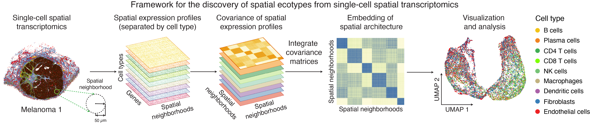

```{r setup, include=FALSE}
knitr::opts_chunk$set(echo = TRUE, warning = FALSE, message = FALSE)
```

# Overview

In this tutorial, we will illustrate how to perform de novo discovery of spatial ecotypes from a single-cell spatial transcriptomics dataset using [SpatialEcoTyper](../reference/SpatialEcoTyper.html).

We will be analyzing single-cell spatial transcriptomics data from a melanoma sample (raw data available in [Vizgen's MERSCOPE FFPE Human Immuno-oncology](https://vizgen.com/data-release-program/)). This demo data comprises the spatial expression of 500 genes across 27,907 cells, which are categorized into ten distinct cell types: B cells, CD4+ T cells, CD8+ T cells, NK cells, plasma cells, macrophages, dendritic cells (DC), fibroblasts, endothelial cells, and melanoma cells. For this tutorial, melanoma cells are excluded to reduce computational time; in practice, any cell types can be included.

All cells in this demo data are grouped into four spatial regions: tumor, inner margin, outer margin, and stroma. The tumor (tumor and inner margin) and stroma regions (stroma. and outer margin) are defined based on the density of cancer cells, as described in the [CytoSPACE paper](https://www.nature.com/articles/s41587-023-01697-9). The inner and outer margins are defined as regions extending 250 μm inside and outside the tumor boundaries, respectively. Furthermore, we quantified each cell’s distance to the tumor–stroma interface by calculating the shortest Euclidean distance to the nearest tumor region (for stromal cells) or stromal region (for tumor cells). A positive distance indicates cells located within the tumor region, while a negative distance indicates cells located within the stroma.

[SpatialEcoTyper](../reference/SpatialEcoTyper.html) requires two input data objects:

* __Gene expression matrix__: a numeric matrix with genes as rows and cells as columns.
* __Metadata__: a data frame containing at least three columns: "X" (x-coordinate), "Y" (y-coordinate), and "CellType" (cell type annotation). Row names must match the column names (cell IDs) in the expression matrix.

__First load required packages for this vignette__

```{r lib}
suppressPackageStartupMessages(library(dplyr))
suppressPackageStartupMessages(library(ggplot2))
suppressPackageStartupMessages(library(parallel))
suppressPackageStartupMessages(library(Seurat))
suppressPackageStartupMessages(library(data.table))
suppressPackageStartupMessages(library(R.utils))

library(SpatialEcoTyper)
```

# Quick start
```{r download1, eval=FALSE}
## Load single-cell gene expression matrix (genes × cells)
url <- "https://spatialecotyper.stanford.edu/inc/inc.public.vignettes.php?file=Melanoma1_subset_counts.tsv.gz"
scdata <- fread(url, sep = "\t",header = TRUE, data.table = FALSE)
rownames(scdata) <- scdata[, 1]
scdata <- as.matrix(scdata[, -1])

## Normalize the gene expression data
normdata <- NormalizeData(scdata)

## Load single-cell metadata
## Required columns: "X", "Y", and "CellType"
## Row names must match the cell IDs in the expression matrix
url <- "https://spatialecotyper.stanford.edu/inc/inc.public.vignettes.php?file=Melanoma1_subset_scmeta.tsv"
scmeta <- read.table(url, sep = "\t", header = TRUE, row.names = 1)
scmeta <- scmeta[match(colnames(scdata), rownames(scmeta)), ]
head(scmeta[, c("X", "Y", "CellType")])

## Discover spatial ecotypes using the SpatialEcoTyper
se_results <- SpatialEcoTyper(normdata, scmeta, 
                              outprefix = "Melanoma1_subset",
                              radius = 50, ncores = 2)
```


# Loading data

<details open><summary><strong>Text files as input</strong></summary>

Large text files can be loaded into R using the `fread` function from the `data.table` package.
```{r text, eval = TRUE}
## Load single-cell gene expression matrix (genes × cells)
url <- "https://spatialecotyper.stanford.edu/inc/inc.public.vignettes.php?file=Melanoma1_subset_counts.tsv.gz"
scdata <- fread(url, sep = "\t",header = TRUE, data.table = FALSE)
rownames(scdata) <- scdata[, 1]
scdata <- as.matrix(scdata[, -1])
head(scdata[, 1:5])

## Load single-cell metadata
## Required columns: "X", "Y", and "CellType"
## Row names must match the cell IDs in the expression matrix
url <- "https://spatialecotyper.stanford.edu/inc/inc.public.vignettes.php?file=Melanoma1_subset_scmeta.tsv"
scmeta <- read.table(url, sep = "\t", header = TRUE, row.names = 1)
scmeta <- scmeta[match(colnames(scdata), rownames(scmeta)), ]
head(scmeta[, c("X", "Y", "CellType")])
```
</details>


<details><summary><strong>Sparse matrix as input</strong></summary>

[SpatialEcoTyper](../reference/SpatialEcoTyper.html) supports sparse matrix as input. Mtx files can be loaded into R using the [`ReadMtx`](https://satijalab.org/seurat/reference/readmtx) function from the Seurat package.

```{r readmtx, eval = FALSE}
scdata <- ReadMtx(mtx = "https://spatialecotyper.stanford.edu/inc/inc.public.vignettes.php?file=Melanoma1_subset_counts.mtx.gz", 
                  cells = "https://spatialecotyper.stanford.edu/inc/inc.public.vignettes.php?file=Melanoma1_subset_cells.tsv.gz", 
                  features = "https://spatialecotyper.stanford.edu/inc/inc.public.vignettes.php?file=Melanoma1_subset_genes.tsv.gz",
                  feature.column = 1, cell.column = 1)
```
</details>

# Data normalization

Gene expression data should be normalized prior to [SpatialEcoTyper](../reference/SpatialEcoTyper.html) analysis. The data can be performed using either [NormalizeData](https://satijalab.org/seurat/reference/normalizedata) or [SCTransform](https://satijalab.org/seurat/articles/seurat5_spatial_vignette_2).

Here, we are normalizing using `NormalizeData`.

```{r NormalizeData, eval = TRUE}
normdata <- NormalizeData(scdata)
```

<details><summary><strong>Using `SCTransform` for the normalization:</strong></summary>
For `SCTransform` normalization, we recommend installing the `glmGamPoi` package to accelerate computation.
```{r SCTransform, eval = TRUE}
if(!"glmGamPoi" %in% rownames(installed.packages())){
  BiocManager::install("glmGamPoi")
}
tmpobj <- CreateSeuratObject(scdata) %>%
      SCTransform(clip.range = c(-10, 10), verbose = FALSE)

seurat_version = as.integer(gsub("\\..*", "", as.character(packageVersion("SeuratObject"))))
if(seurat_version<5){
  normdata <- GetAssayData(tmpobj, "data")
}else{
  normdata <- tmpobj[["SCT"]]$data
}
```
</details>

# Preview of the sample

The [SpatialView](../reference/SpatialView.html) function can be used to visualize single cells within the tissue. You can color the cells by cell type or predefined spatial regions.

```{r viewct}
# Visualize the cell type annotations in the tissue
SpatialView(scmeta, by = "CellType") + scale_color_manual(values = pals::cols25())
```

```{r viewregion}
# Visualize the regions in the tissue
SpatialView(scmeta, by = "Region") + scale_color_brewer(type = "qual", palette = "Set1")
```

The [SpatialView](../reference/SpatialView.html) function can also be used to visualize continuous characteristics, such as the minimum distance of each single cell to tumor/stroma margin. Here, positive distances indicate cells located within the tumor region, while negative distances denote cells within the stroma. 

```{r viewdist}
# Visualize the distance to tumor margin
SpatialView(scmeta, by = "Dist2Interface") + 
  scale_colour_gradient2(low = "#5e3c99", high = "#e66101", 
                         mid = "#d9d9d9", midpoint = 0) + 
  labs(color = "Distance to\ntumor margin")
```


# SE discovery using SpatialEcoTyper
```{r workflow, out.width = '100%', echo=FALSE}

```

The [SpatialEcoTyper](../reference/SpatialEcoTyper.html) function is designed to identify spatial ecotypes (SEs) from single-cell spatial transcriptomics data. The workflow begins by defining spatial neighborhoods (SNs) on a regular grid and constructing cell type–specific gene expression profiles (GEPs) for each SN. For each cell type, a similarity network is constructed, where nodes represent SNs and edges reflect transcriptional similarity. These cell type–specific networks are then integrated using Similarity Network Fusion (SNF), originally developed for multi-omics data integration ([Wang et al., 2014](https://www.nature.com/articles/nmeth.2810)). This yields a fused similarity network that captures shared spatial transcriptomic variation across cell types, enabling the identification of SEs through clustering.
Before start, please check key arguments [here](../reference/SpatialEcoTyper.html).

<details><summary><strong>Selection of Spatial EcoTyper parameters</strong></summary>

__Choosing the radius parameter__: The optimal spatial neighborhood `radius` depends on the biological question. Larger radii capture broader regional patterns, whereas smaller radii resolve more localized cellular niches. In our analysis, we used a radius of 50 µm, which typically includes ~10–80 neighboring cells and provides a practical balance between granularity and robustness.

__Choosing the number of variable features__: The `nfeatures` argument should be selected according to the underlying data platform. For Vizgen MERSCOPE V1 (500-gene panel), we used 200 highly variable features, whereas for Xenium Prime data, we used 300 variable features. As single-cell spatial transcriptomics technologies continue to evolve, the number of detectable genes per cell has steadily increased. For example, the latest 10x Aera platform captures over 1,000 genes per cell on average. For such high-complexity datasets, we recommend using up to 1,000 highly variable genes for downstream analysis to better capture biological variability.

__Limiting the number of cell types per spatial neighborhood__: The `min.cts.per.region` argument allows users to filter spatial regions based on cellular diversity by requiring a minimum number of distinct cell types per region (default: ≥ 2). This helps ensure that downstream analyses focus on biologically informative neighborhoods with sufficient cellular heterogeneity.

__Limiting analysis to spatial neighborhoods containing specific cell types__: The `filter.region.by.celltypes` argument allows users to define a set of cell types of interest. When specified, only spatial regions that contain all of the selected cell types are retained for downstream analysis. This enables focused interrogation of neighborhoods enriched for predefined cellular compositions, facilitating the identification of multicellular ecosystems associated with the target cell types.
</details>

```{r snf, eval = TRUE}
se_results <- SpatialEcoTyper(normdata, scmeta,
                              outprefix = "Melanoma1_subset",
                              radius = 50, ncores = 2)
```

<details><summary><strong>Optimizing memory usage</strong></summary>

The similarity network fusion (Step 2 of SpatialEcoTyper) is the most computationally demanding step and its runtime increases with the number of spatial neighborhoods (SNs) per sample. Performance depends on dataset size and structure rather than tissue technology.

```{r resource, out.width = '100%', echo=FALSE}
knitr::include_graphics("images/SpatialEcoTyper_Runtime_memory.png")
```
For example, an analysis involving 10 cell types and 18,564 SNs required 436 minutes of runtime and reached a peak memory usage of 169 GB. This benchmark was obtained on a computing cluster equipped with an AMD EPYC 7543 processor (2.75 GHz) and 256 GB RAM, using a single CPU core and excluding data loading time.

To reduce runtime, users can increase the number of cores via the `ncores` parameter. However, this parallelization comes at the cost of increased memory consumption.

When memory resources are limited, users can increase the `grid.size` parameter, which will reduce the number of spatial neighborhoods, thereby substantially lowering memory usage and improving computational efficiency.

</details>

# SpatialEcoTyper result

When the `outprefix` is specified, the [SpatialEcoTyper](../reference/SpatialEcoTyper.html) result will be saved as a RDS file named `outprefix_SpatialEcoTyper_results.rds`. The result can be loaded into R using `readRDS`.
```{r loadres, eval=FALSE}
se_results <- readRDS("Melanoma1_subset_SpatialEcoTyper_results.rds")
```

The [SpatialEcoTyper](../reference/SpatialEcoTyper.html) result is a list containing two key components: 

* __Seurat object__ constructed from the fused network embedding of spatial neighborhoods, enabling clustering and downstream visualization of SEs. 
* __Metadata__, single-cell metadata with SE annotations appended.

```{r seres}
# Extract the Seurat object and updated single-cell metadata
obj <- se_results$obj # A Seurat object
scmeta <- se_results$metadata # Single-cell meta data, with SE annotation added
head(scmeta)
table(scmeta$SE) ## The number of cells in each SE
```
**Note**: SpatialEcoTyper applies stringent quality control to exclude low-quality spatial neighborhoods, including those with insufficient detected genes (`min.features`), too few cells (`min.cells`), or insufficient cell type diversity (`min.cts.per.region`). These regions are labeled as NA. Regions excluded at one resolution (`radius`, `grid.size`) may be retained at a lower resolution if they pass QC. In practice, different resolutions have minimal impact on overall results. By default, NA regions are removed. To retain all cells, set `dropcell = FALSE`.

# Embedding of spatial architecture

The embedding of spatial neighborhoods can be visualized using standard [Seurat functions](https://satijalab.org/seurat/articles/visualization_vignette) such as `DimPlot` and `FeaturePlot`. These visualizations help to explore the spatial organization and heterogeneity within the tissue.

**Note**: The embedding and clustering results differ slightly between Seurat v4 and v5. However, the overall clustering patterns remain largely consistent, with an Adjusted Rand Index (ARI) of 0.7 for the demonstration dataset. This consistency ensures that, despite minor variations, the key biological insights are preserved across versions.

## Visualizing tumor/stroma regions in the embedding

```{r umap_region}
DimPlot(obj, group.by = "Region") + scale_color_brewer(type = "qual", palette = "Set1")
```

## Visualizing the distance of SNs to tumor/stroma interface

This plot shows the distance of each SN to the tumor/stroma interface.  Here, positive distances indicate SNs located within the tumor region, while negative distances denote SNs within the stroma. 

```{r umap_dist}
FeaturePlot(obj, "Dist2Interface", min.cutoff = -600, max.cutoff = 600) + 
  scale_colour_gradient2(low = "#5e3c99", high = "#e66101", mid = "#d9d9d9", midpoint = 0)
```

## Visualizing spatial ecotypes in the embedding

This plot visualizes the SEs within the spatial embedding. Each SE represents a distinct spatial ecosystem with unique molecular and spatial characteristics, and may also differ in cell type composition.

```{r umap_se}
DimPlot(obj, group.by = "SE") + scale_color_manual(values = pals::kelly()[-1])
```

# SE characteristics

## Visualizing SEs in the tissue

The spatial distribution of SEs within the tissue can be visualized using the [SpatialView](../reference/SpatialView.html) function.

```{r spatialmap}
SpatialView(scmeta, by = "SE")
```

## Visualizing the cell type composition of SEs

The bar plot below illustrates the cell type composition within each SE.

```{r bar_ct}
gg <- scmeta %>% filter(!is.na(SE)) %>% count(SE, CellType)
ggplot(gg, aes(SE, n, fill = CellType)) + 
  geom_bar(stat = "identity", position = "fill") +
  scale_fill_manual(values = pals::cols25()) +
  theme_bw(base_size = 14) + coord_flip() + 
  labs(y = "Cell type abundance")
```

## Visualizing the association between SEs and pre-annotated regions

This bar plot shows the enrichment of SEs in pre-defined regions (e.g., tumor and stroma).

```{r bar_region}
gg <- scmeta %>% filter(!is.na(SE)) %>% count(SE, Region)
ggplot(gg, aes(SE, n, fill = Region)) + 
  geom_bar(stat = "identity", position = "fill") + 
  scale_fill_brewer(type = "qual", palette = "Set1") +
  theme_bw(base_size = 14) + coord_flip() + 
  labs(y = "Fraction")
```

## Visualizing the distance of SEs to tumor/stroma interface

This box plot visualizes the distribution of distances of SEs to the tumor/stroma interface. Positive distances indicate cells located within the tumor region, while negative distances denote cells within the stroma. The SEs are ordered by their median distance, highlighting their spatial localization relative to the tumor/stroma interface.

```{r box_dist}
gg <- scmeta %>% filter(!is.na(SE))
## Order SEs by their distance to tumor/stroma interface
tmp <-  gg %>% group_by(SE) %>% summarise(Mid = median(Dist2Interface)) %>% arrange(Mid) %>% pull(SE)
gg$SE = factor(gg$SE, levels = tmp)
ggplot(gg, aes(SE, Dist2Interface)) + 
  geom_boxplot() + theme_bw() + labs(y = "Distance to tumor/stroma interface (μm)")
```

# Identification of cell-type-specific SE markers

## Differential expression analysis

To identify cell-type-specific SE markers, differential expression analysis can be performed using the [`presto` package](https://github.com/immunogenomics/presto) package. The script below demonstrates how to identify SE-specific markers within each cell type.

```{r deg}
if(!"presto" %in% installed.packages()){ 
  BiocManager::install("devtools")
  devtools::install_github("immunogenomics/presto")
}
library("presto")

# Ensure normalized data is aligned with metadata
normdata = normdata[, rownames(scmeta)]

# Perform differential expression analysis
degs = lapply(unique(scmeta$CellType), function(ct){
  idx = which(scmeta$CellType==ct & !is.na(scmeta$SE))
  degs = wilcoxauc(normdata[, idx], scmeta$SE[idx])
  degs$CellType = ct
  degs
})
degs = do.call(rbind, degs)

# Example: top markers for CD4 T cells
degs %>% filter(CellType=="CD4T") %>% 
  filter(logFC>0 & padj<0.05) %>% 
  arrange(desc(logFC)) %>% head()
```

## Visualizing the expression of cell state markers

Once candidate markers are identified, their expression can be visualized across SEs.

### Visualizing SE-specific markers using heatmap

The example below identifies SE-specific markers in CD4 T cells and visualizes their relative expression across SEs using a heatmap.

```{r deghmap}
library(tidyr)
# Identify significant DEGs
sigDegs = degs %>% filter(CellType=="CD4T") %>% filter(logFC>0 & padj<0.05)
# Identify genes with highest specificity per SE
top_markers <- sigDegs %>% group_by(feature) %>% arrange(desc(logFC)) %>%
  summarize(Highest_SE = first(group), Highest_logFC = first(logFC), 
            Second_logFC = nth(logFC, 2, default = 0),
            Delta = Highest_logFC - Second_logFC) %>% ungroup() %>%
  # Keep top 5 markers per SE based on Delta
  group_by(Highest_SE) %>% arrange(desc(Delta)) %>%
  slice_head(n = 5) %>% ungroup()

# Prepare logFC matrix for heatmap
lfcs = degs %>% filter(CellType=="CD4T") %>% 
        pivot_wider(id_cols = feature, names_from = group,
                    values_from = logFC) %>% as.data.frame
rownames(lfcs) = lfcs$feature
lfcs = lfcs[, -1]
gg <- lfcs[top_markers$feature, unique(top_markers$Highest_SE), drop = FALSE]

# Scale for visualization
gg = scale(t(scale(t(gg), center = FALSE)))
# Plot heatmap
HeatmapView(gg, breaks = c(0, 1, 1.5))
```

### Visualizing an individual marker using box plot

You can also visualize the expression of an individual gene across SEs.

```{r visualizedeg}
# Subset CD4 T cells with SE annotation
idx = which(scmeta$CellType=="CD4T" & !is.na(scmeta$SE))
gg = scmeta[idx, ]
gg$Expression = normdata["FOXP3", idx]
ggplot(gg, aes(SE, Expression)) + geom_boxplot(outlier.shape = NA) + 
  theme_classic(base_size = 14) + ylab("FOXP3 expression")
```

### Visualizing expression of SE marker in the tissue

You can also visualize the expression of an individual marker (e.g., FOXP3) or average expression of SE-specific markers in the tissue.

```{r viewgene}
# Visualize gene expression in tissue
gg <- scmeta
gg$Expression = normdata["FOXP3", ]

SpatialView(gg, by = "Expression") +
  scale_color_viridis_c() +
  labs(color = "FOXP3\nexpression")
```

# Session info

The session info allows users to replicate the exact environment and identify potential discrepancies in package versions or configurations that might be causing problems.

```{r session}
sessionInfo()
```
